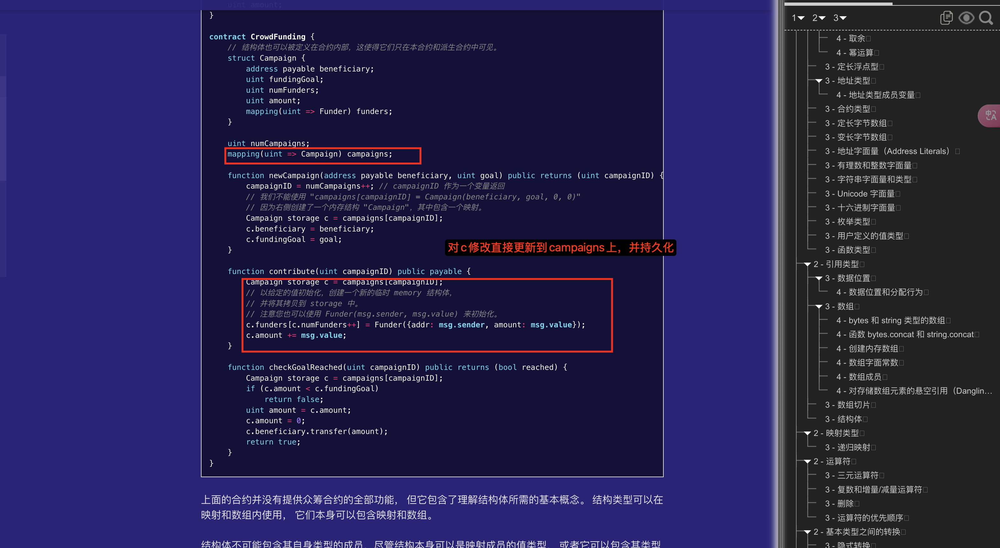

## 规则

当然，这里是一些关于 Solidity 中 `storage` 和 `memory` 的规则和注意事项：

### Storage 和 Memory 的区别

1. **Storage**：
   - 永久存储在区块链上。
   - 修改 storage 会消耗 gas。
   - 合约状态变量默认存储在 storage 中。

2. **Memory**：
   - 临时存储，只在函数调用期间有效。
   - 不会永久保存，也不消耗额外的 gas。
   - 函数内部的临时变量默认存储在 memory 中。

### 规则和注意事项

1. **Storage 引用**：
   - 可以通过 `storage` 引用指向已有的存储对象。
   - 不能直接删除或重新分配 `storage` 引用。
   - 例如： `uint[] storage y = dataArray;`

2. **Memory 引用**：
   - 可以用于临时数据处理。
   - 可以自由分配和删除，不影响存储在区块链上的数据。

3. **Delete 操作**：
   - `delete` 用于将变量重置为默认值。
   - 对于 storage 类型， `delete` 会影响实际存储的数据。
   - 对于 memory 类型， `delete` 只是简单地重置值。

4. **数组和结构体**：
   - `delete` 数组时，会将其长度设为 0。
   - `delete` 结构体时，会将其所有成员重置为默认值。

5. **局部变量**：
   - `storage` 类型的局部变量必须指向已有的存储对象，不能单独存在。
   - `memory` 类型的局部变量可以独立存在并操作。

6. **函数参数**：
   - 可以指定参数为 `memory` 或 `storage` 。
   - 默认情况下，复杂类型（如数组、结构体）参数为 `memory` 。

### 实践建议

* 小心操作 `storage`，因为它涉及到实际存储在区块链上的数据。
* 使用 `memory` 进行临时计算和数据处理。
* 理解 `delete` 的行为，确保不会误删或误操作数据。

这些规则和注意事项帮助你更好地管理 Solidity 中的数据存储和操作。

## 局部storage



是的，在这个合约中，局部变量使用 `storage` 是为了直接操作 `campaigns` 映射中的数据。

### 具体解释

1. **`Campaign storage c = campaigns[campaignID];`**:
   - 这行代码创建了一个指向 `campaigns` 映射中指定 `campaignID` 的 `Campaign` 结构体的引用。
   - 使用 `storage` 关键字意味着对 `c` 的任何修改都会直接影响到 `campaigns` 映射中的数据。

2. **为什么使用 `storage`**:
   - **持久化修改**：需要对存储在区块链上的数据进行修改，这些修改必须是持久的。
   - **直接引用**：通过引用来操作复杂的嵌套数据结构（如映射和结构体）是更为高效的方式。

3. **在函数中操作 `c`**:
   - 当你修改 `c.beneficiary` 、 `c.fundingGoal` 、 `c.numFunders` 、 `c.amount` 或 `c.funders` 时，这些修改会反映在 `campaigns` 映射中对应的 `Campaign` 结构体上。

### 总结

使用 `storage` 关键字使得函数可以高效地操作合约的持久化状态，而无需将整个结构体复制到内存中进行操作。这是 Solidity 中处理复杂数据结构的一种常见模式。

## 为什么局部变量要设计成storage, 全用memory不好吗？

在 Solidity 中，局部变量有时需要设计成 `storage` 类型，主要是因为以下原因：

### 1. 引用现有存储数据

* **共享状态**：有时需要对合约中已经存在的存储变量进行操作，而不仅仅是临时数据处理。
* **效率**：直接操作 `storage` 可以避免将数据从存储复制到内存并再复制回存储的开销。

### 2. 数据一致性

* **持久性**：`storage` 确保对变量的修改会永久保存到区块链上。
* **引用语义**：`storage` 引用允许多个变量指向同一存储位置，确保一致性。

### 3. 内存限制

* **内存限制**：`memory` 是有限的，不能无限制地存储大量数据。
* **Gas 成本**：在某些情况下，使用 `memory` 可能会导致更高的 gas 成本，特别是当涉及到大量数据时。

### 4. 复杂数据结构

* **复杂数据结构**：对于复杂数据结构（如数组和映射），有时需要直接操作存储中的数据。

### 何时使用 Memory

* **临时计算**：适用于临时数据和计算，不需要持久化。
* **函数参数**：用于传递不需要修改的复杂参数。

### 总结

虽然 `memory` 在某些情况下更高效，但在处理合约状态和持久化数据时， `storage` 是必要的。选择 `storage` 或 `memory` 取决于具体需求和操作对象。

## 既然提到内存不够使用storage，mac电脑本上是不是也是这样的？

在 Mac 电脑或其他计算机上，内存管理与 Solidity 合约中的内存管理有很大不同：

### 计算机内存管理

1. **RAM 和硬盘**：
   - **RAM（内存）**：用于存储临时数据和运行程序，速度快，但容量有限。
   - **硬盘（存储）**：用于持久化存储数据，容量大，但速度较慢。

2. **虚拟内存**：
   - 当 RAM 不足时，操作系统会使用硬盘的一部分作为虚拟内存（交换分区）。
   - 虚拟内存比 RAM 慢，但可以防止程序因内存不足而崩溃。

3. **数据持久性**：
   - RAM 中的数据在计算机关机或重启时会丢失。
   - 硬盘上的数据是持久的，不会因断电而丢失。

### Solidity 合约内存管理

* **Memory**：临时存储，函数调用结束后即释放。
* **Storage**：永久存储在区块链上，数据持久且安全。

### 主要区别

* **持久性**：计算机的硬盘和 Solidity 的 storage 都用于持久化存储，但 Solidity 的 storage 是区块链上的全局状态。
* **速度和效率**：计算机内存和硬盘之间的速度差异比 Solidity 的 memory 和 storage 更显著。

总之，虽然概念上有相似之处，但实际实现和用途上差别很大。

## 在 Solidity 中，确实不能直接遍历映射的键

> 不能对映射进行递归调用，也就是说，您不能列举它们的键。 不过，可以在它们上层实现一个数据结构，并对其进行递归。

在 Solidity 中，确实不能直接遍历映射的键。但可以通过实现一个辅助数据结构来跟踪键，从而实现类似的功能。通常会使用一个数组来存储所有键，并结合映射来实现可迭代的映射。

下面是一个简单的 `IterableMapping` 示例：

```solidity
// SPDX-License-Identifier: MIT
pragma solidity ^0.8.0;

library IterableMapping {
    struct Map {
        address[] keys;
        mapping(address => uint) values;
        mapping(address => bool) inserted;
    }

    function set(Map storage map, address key, uint val) public {
        if (!map.inserted[key]) {
            map.inserted[key] = true;
            map.keys.push(key);
        }
        map.values[key] = val;
    }

    function get(Map storage map, address key) public view returns (uint) {
        return map.values[key];
    }

    function getKeys(Map storage map) public view returns (address[] memory) {
        return map.keys;
    }
}

contract User {
    using IterableMapping for IterableMapping.Map;
    IterableMapping.Map private data;

    function addValue(address key, uint val) public {
        data.set(key, val);
    }

    function sum() public view returns (uint) {
        uint total = 0;
        address[] memory keys = data.getKeys();
        for (uint i = 0; i < keys.length; i++) {
            total += data.get(keys[i]);
        }
        return total;
    }
}
```

### 解释：

1. **`IterableMapping` 库**：
   - `Map` 结构体包含一个数组 `keys` 用于存储所有键。
   - `values` 映射存储每个键对应的值。
   - `inserted` 映射用于跟踪键是否已经插入。

2. **`set` 函数**：
   - 如果键尚未插入，将其添加到 `keys` 数组中。
   - 更新或设置该键对应的值。

3. **`getKeys` 函数**：
   - 返回所有存储的键。

4. **`User` 合约**：
   - 使用 `IterableMapping` 库来管理数据。
   - `addValue` 函数用于添加或更新键值对。
   - `sum` 函数迭代所有键，累加其对应的值。

这种方法允许我们在不直接支持遍历的映射上实现迭代功能。

## `using IterableMapping for IterableMapping.Map; 啥意思？ import from ?`

`using IterableMapping for IterableMapping.Map;` 是 Solidity 中的一种语法，用于将库函数附加到特定的数据类型上。以下是详细解释：

### 解释

1. **库（Library）**：
   - `IterableMapping` 是一个库，包含了一组可以操作 `Map` 结构体的函数。

2. **`using ... for` 语法**：
   - `using IterableMapping for IterableMapping.Map;` 表示将 `IterableMapping` 库中的函数附加到 `IterableMapping.Map` 类型上。
   - 这样， `Map` 类型的变量可以直接调用库中的函数，就像调用自己的成员函数一样。

3. **使用示例**：
   - 假设有一个 `Map` 类型的变量 `data` ：

     

```solidity
     IterableMapping.Map private data;
     ```

   - 可以直接调用库函数，如：

     

```solidity
     data.set(key, value);
     ```

   - 这相当于调用 `IterableMapping.set(data, key, value);`

### `import` 语句

* 如果 `IterableMapping` 库定义在外部文件中，需要使用 `import` 语句引入：
  

```solidity
  import "./IterableMapping.sol";
  ```

* 如果库和合约在同一个文件中定义，则不需要 `import`。

这种方式使得代码更加简洁和模块化，方便复用库中的功能。

## 结构体数据与方法分离，通过这种方式可以将结构体数据与方法 结合到一起，是不是函数的第一个参数必须是结构体类型？

是的，当你使用 `using ... for` 语法时，库函数的第一个参数必须是结构体类型。这使得该结构体可以像对象一样调用这些函数。

### 具体说明

* **库函数定义**：
  + 库中的函数通常将结构体类型作为第一个参数。
  + 例如，在 `IterableMapping` 中：
    

```solidity
    function set(Map storage map, address key, uint val) public {
        // 函数体
    }
```

* **调用方式**：
  + 使用 `using ... for` 后，可以直接在结构体实例上调用这些函数。
  + 例如：
    

```solidity
    data.set(key, value);
```

  + 这与调用 `IterableMapping.set(data, key, value);` 等价。

### 优点

* **代码简洁**：使代码更简洁，易读。
* **模块化**：将数据和相关操作逻辑结合在一起，增强模块化设计。

这种方式在 Solidity 中非常常见，用于增强数据结构的功能和可用性。

## calldata memory

> `带有 calldata 参数的外部函数与带有 calldata 参数的外部函数类型不兼容。 它们与相应的带有memory 参数的类型兼容。例如，没有一个函数可以被 function(string calldata)externa]类型的值所指向，而 function(string memory)external 可以同时指向 function f(strincmemory)external{}和 function g(string calldata)external{}。这是因为对于这两个位置，参数是以同样的方式传递给函数的。调用者不能直接将其calldata传递给外部函数，总是ABI将参数编码到内存中。 将参数标记为 calldata 只影响到外部函数的实现，在调用者一方的函数指针中是没有意义的。`

这段话解释了 Solidity 中 `calldata` 和 `memory` 参数在外部函数中的兼容性问题。让我为你详细解释一下：

### 基本概念

1. **`calldata`**：
   - 用于外部函数参数。
   - 数据直接从调用者传入，不可修改。
   - 存储在只读区域，节省 gas。

2. **`memory`**：
   - 用于临时存储数据。
   - 数据可修改。
   - 在函数调用结束后释放。

### 兼容性问题

* **函数类型指针**：
  + 在 Solidity 中，函数可以作为类型使用，比如 `function(string memory) external`。
  + 当你使用函数类型时，参数的存储位置（`calldata` 或 `memory`）需要兼容。

* **`calldata` 与 `memory` 兼容性**：
  + `function(string calldata) external` 类型的函数指针不能指向带有 `calldata` 参数的外部函数。
  + 这是因为在函数指针中，参数是通过 ABI 编码到内存中传递的，而不是直接使用 `calldata`。
  + `function(string memory) external` 类型的函数指针可以指向带有 `memory` 或 `calldata` 参数的外部函数，因为在这两种情况下，参数最终都在内存中处理。

### 结论

* 将参数标记为 `calldata` 是为了优化函数实现，而不是影响函数指针的使用。
* 函数指针的参数传递总是通过内存进行，因此 `memory` 参数类型更具通用性。

希望这能帮助你理解 `calldata` 和 `memory` 在外部函数中的兼容性问题！

## 带有 calldata 参数的外部函数与带有 calldata 参数的外部函数类型不兼容 ?

> 是的，即使两个外部函数的参数都是 `calldata` 类型，它们在函数指针类型中仍然不兼容。这是因为函数指针需要在内存中处理参数，而 `calldata` 参数在这种情况下无法直接使用。
> 换句话说，虽然两个函数都可以使用 `calldata` 参数，但在函数指针的上下文中，它们的参数处理方式不同，导致它们不兼容。函数指针需要将参数编码到内存中，而 `calldata` 直接在只读区域中使用。
> 因此，在定义函数指针时，使用 `memory` 参数类型会更具通用性，因为它允许参数在内存中处理，无论原始参数是 `calldata` 还是 `memory` 。

## 接收以太转账，要在本合约中记录from的余额？或者这个合约的余额？好像不用记吧？

在 Solidity 中，接收以太币的合约不需要手动记录发送者的余额或合约的余额，因为以太坊网络会自动维护这些信息。以下是一些要点：

1. **合约的余额**：
   - 可以通过 `address(this).balance` 获取合约当前持有的以太币总额。

2. **发送者的余额**：
   - 以太坊网络自动维护每个地址的余额，合约不需要手动记录。
   - 如果你的业务逻辑需要跟踪每个发送者的贡献，你可以在合约中记录这些信息。

3. **何时记录发送者的余额**：
   - 如果你的应用需要知道每个地址发送了多少以太币（例如，为了实现一个众筹合约），你可以使用一个映射来记录：

     

```solidity
     mapping(address => uint256) public contributions;

     receive() external payable {
         contributions[msg.sender] += msg.value;
     }
```

总结来说，如果你的业务逻辑不需要*跟踪每个发送者的贡献*，那么不需要手动记录这些信息。合约的总余额可以通过以太坊网络自动查询。

## 没有payable，发了币，会回滚？

是的，如果一个合约没有将接收以太币的函数标记为 `payable` ，那么任何试图向该函数发送以太币的交易都会回滚。这是因为非 `payable` 函数无法接收以太币。

如果你希望一个函数能够接收以太币，你需要明确地将其标记为 `payable` 。例如：

```solidity
function deposit() external payable {
    // 处理接收到的以太币
}
```

对于 `receive` 和 `fallback` 函数，如果希望它们接收以太币，也必须标记为 `payable` 。否则，任何发送以太币的尝试都会导致交易回滚。

## 理解继承

> 对于多重继承，必须在 override 关键字后明确指定定义同一函数的最多派生基类合约。 换句话说，您必须指定所有定义同一函数的基类合约， 并且还没有被另一个基类合约重写（在继承图的某个路径上）。 此外，如果一个合约从多个（不相关的）基类合约上继承了同一个函数，必须明确地重写它。
>  
> 如果函数被定义在一个共同的基类合约中， 或者在一个共同的基类合约中有一个独特的函数已经重写了所有其他的函数， 则不需要明确的函数重写指定符。
>
> 怎么理解

在 Solidity 中，多重继承可能会导致函数冲突，因此需要使用 `override` 关键字来明确指定哪个基类的实现应该被使用。以下是对这种机制的详细解释：

1. **明确指定基类**：
   - 当一个函数在多个基类中被定义时，你必须在 `override` 关键字后列出所有相关的基类。这是为了明确指定你希望使用哪些基类的实现。

2. **继承路径上的重写**：
   - 如果一个基类合约中的函数已经被另一个基类合约重写，那么在继承图中，这个函数的实现已经被确定，通常不需要再次明确指定。

3. **不相关的基类**：
   - 如果从不同的（不相关的）基类继承了同一个函数，必须在派生合约中显式重写这个函数，以避免冲突。

4. **共同基类的情况**：
   - 如果一个函数在一个共同的基类中已经被重写，并且这个重写版本唯一地覆盖了其他版本，那么不需要在派生合约中再次重写。

这种机制确保了函数调用的明确性和继承关系的可预测性，防止了由于多重继承而导致的模糊和冲突。

## 示例代码

当然，这里有一个示例代码，展示了如何在 Solidity 中处理多重继承和 `override` ：

```solidity
// 基类合约 A
contract A {
    function foo() public virtual returns (string memory) {
        return "A";
    }
}

// 基类合约 B
contract B {
    function foo() public virtual returns (string memory) {
        return "B";
    }
}

// 合约 C 继承自 A 和 B
contract C is A, B {
    // 必须明确指定要重写 A 和 B 中的 foo 函数
    function foo() public override(A, B) returns (string memory) {
        return super.foo(); // 可以选择调用 super 来调用特定的实现
    }
}

// 合约 D 继承自 A
contract D is A {
    // 由于只有一个基类 A 定义了 foo，所以不需要明确指定
    function foo() public override returns (string memory) {
        return "D";
    }
}

// 合约 E 继承自 C 和 D
contract E is C, D {
    // 必须明确指定要重写 C 和 D 中的 foo 函数
    function foo() public override(C, D) returns (string memory) {
        return "E";
    }
}
```

在这个例子中：

* 合约 `C` 继承了 `A` 和 `B`，所以在重写 `foo` 时必须指定 `override(A, B)`。
* 合约 `D` 继承了 `A`，所以只需 `override`。
* 合约 `E` 继承了 `C` 和 `D`，所以在重写 `foo` 时必须指定 `override(C, D)`。

这种方式确保了函数调用的明确性，避免了多重继承导致的冲突。

## 继承自多个合约的同名方法，必须重写吗？

是的，当一个合约继承自多个合约且这些合约中有同名方法时，必须在派生合约中重写该方法。这是为了避免函数冲突，并明确指定要使用哪个基类的实现。

以下是一个示例：

```solidity
// 基类合约 A
contract A {
    function foo() public virtual returns (string memory) {
        return "A";
    }
}

// 基类合约 B
contract B {
    function foo() public virtual returns (string memory) {
        return "B";
    }
}

// 合约 C 继承自 A 和 B
contract C is A, B {
    // 必须重写 foo 方法，并在 override 后指定 A 和 B
    function foo() public override(A, B) returns (string memory) {
        return super.foo(); // 可以选择调用 super 来调用特定的实现
    }
}
```

在这个例子中， `C` 继承了 `A` 和 `B` ，因为 `A` 和 `B` 都定义了 `foo` ，所以 `C` 必须重写 `foo` ，并在 `override` 后指定 `A` 和 `B` 。这样可以确保继承关系的明确性和函数调用的正确性。
