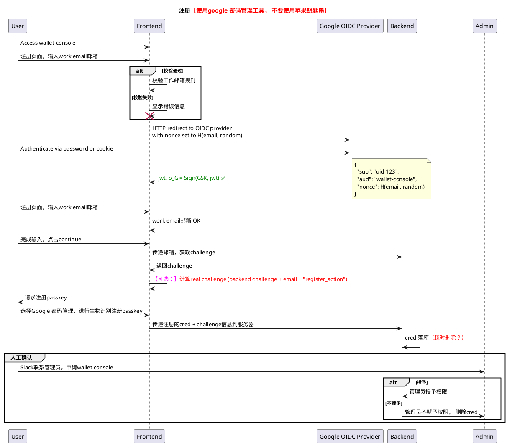

## google OIDC 放置 在passkey创建之前

在设计流程时，通常需要考虑安全性和用户体验。以下是两种可能的方案：

1. **在创建 Passkey 之前进行 Google OIDC 验证**：
   - **优点**：确保用户身份在注册 Passkey 之前已被验证。
   - **流程**：
     - 用户通过 Google OIDC 验证身份。
     - 验证成功后，用户继续进行 Passkey 的创建。

2. **在创建 Passkey 与人工确认之间进行 Google OIDC 验证**：
   - **优点**：用户在创建 Passkey 后立即进行身份验证，确保在进行人工确认前身份已被验证。
   - **流程**：
     - 用户首先创建 Passkey。
     - 然后进行 Google OIDC 验证。
     - 最后进行人工确认。

**建议**：
- 如果身份验证是注册流程的关键部分，并且需要确保用户的真实性，建议在创建 Passkey 之前进行 Google OIDC 验证。
- 如果创建 Passkey 的过程本身不需要立即验证用户身份，可以在创建 Passkey 后进行 Google OIDC 验证。

选择取决于具体的安全需求和用户体验设计目标。

## 相关



<!-- group 激活确认 <color #ff00ff>【通过id_token解析出来email是否是passkey对应的账号】</color>

end -->


<!-- 
```plantuml
Participant User
Participant Frontend
Participant Backend
Participant Admin

title: 注册<color #ff0000>【使用google 密码管理工具， 不要使用苹果钥匙串】</color>
User->Frontend: 注册页面，输入work email邮箱
User -> Frontend: 完成输入，点击continue
Frontend -> Backend: 传递邮箱，获取challenge
Backend -> Frontend: 返回challenge
Frontend -> Frontend: <color #ff00ff>【可选：】</color><color #ff0000>计算real challenge (backend challenge + email + "register_action")</color>
User <- Frontend: 请求注册passkey
User -> Frontend: 选择Google 密码管理，进行生物识别注册passkey
Frontend-> Backend: 传递注册的cred + challenge信息到服务器
Backend->Backend: cred 落库<color #ff0000>（超时删除？）</color>
group 激活码确认 <color #ff00ff>【如果需要：改成google auth, 通过id_token解析出来email是否是passkey对应的账号】</color>
Backend -> User: 发送totp到work email
User -> Backend: 注册激活码确认
end
group 人工确认
User -> Admin: Slack联系管理员，申请wallet console 

alt 授予
Admin -> Backend: 管理员授予权限
else 不授予
Admin <- Backend: 管理员不赋予权限， 删除cred
end
end
``` -->

```plantuml
Participant User
Participant Frontend
Participant Backend
Participant Admin
title: 登录- 临时公私钥对，像passkey的代理人一样，处理数据签名


User->Frontend: 登录页面，输入work email邮箱
Frontend -> Backend: 获取challenge
Frontend -> Frontend:  <color #ff00ff>【可选：】</color><color #ff0000>计算real challenge (backend challenge + email + "login_action")</color>
Frontend -> Frontend: 生成公私钥对
Frontend -> Frontend: 签名(challenge + 公钥)
Frontend -> Backend: 传递公钥 + 签名
Backend -> Backend: 验证passkey签名
Backend -> Backend: 生成服务端公私钥对
Backend -> Frontend: 返回服务端公钥、Token
Frontend <-> Backend: <color #ff0000>Diffie-Hellman密钥交换</color>
Frontend <-> Backend: 业务请求，传递（签名/加密）
Backend -> Backend: 验证Token有效性
Backend -> Backend: 验证数据签名
alt 成功
Frontend <- Backend: 验证成功返回200状态码+数据
else 某种失败
Frontend <- Backend: 否则返回对应状态码
end


```
```plantuml
Participant User
Participant Frontend
Participant Backend
Participant Admin
title: 登录态管理
group 停用
Admin->Backend: 回收用户权限
end

group 登录态管理
Admin->Backend: token失效or手动清理redis中用户token
end

```
```plantuml
Participant User
Participant Frontend
Participant Backend
Participant Admin
title: 账号恢复 [用户丢失设备、 系统重装]

User->Frontend: 重置页面，输入work email邮箱
User -> Frontend: 完成输入，点击continue
Frontend -> Backend: 传递邮箱，获取challenge
Backend -> Frontend: 返回challenge
Frontend -> Frontend:  <color #ff00ff>【可选：】</color><color #ff0000>计算real challenge (backend challenge + email + "recover_action")</color>
User <- Frontend: 请求注册passkey
User -> Frontend: 选择Google 密码管理，进行生物识别注册passkey
Frontend-> Backend: 传递注册的cred + challenge信息到服务器
Backend->Backend: 新cred 落库<color #ff0000>（超时删除？）</color>
group 激活确认 <color #ff00ff>【通过id_token解析出来email是否是passkey对应的账号】</color>
end
group 人工确认
User -> Admin: Slack联系管理员，重置passkey
alt 审批通过
Admin -> Backend: 管理员审批通过，重置用户passkey

else 审批不通过
Admin <- Backend: 管理员审批不通过，删除新cred
end
end
```