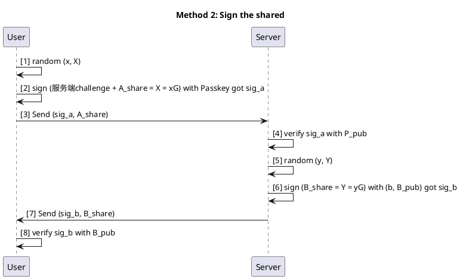

```plantuml
@startuml
title Method 2: Sign the shared

Participant User
Participant Server

User -> User: [1] random (x, X)
User -> User: [2] sign (服务端challenge + A_share = X = xG) with Passkey got sig_a
User -> Server: [3] Send (sig_a, A_share)

Server -> Server: [4] verify sig_a with P_pub
Server -> Server: [5] random (y, Y)
Server -> Server: [6] sign (B_share = Y = yG) with (b, B_pub) got sig_b
Server -> User: [7] Send (sig_b, B_share)

User -> User: [8] verify sig_b with B_pub


@enduml
```
