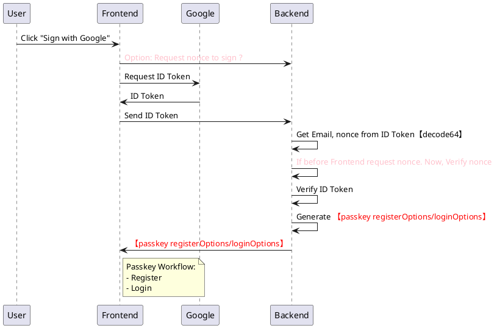

```plantuml
@startuml
participant User
participant Frontend
participant Google

User -> Frontend: Click "Sign with Google"
Frontend -> Backend:<color pink>Option: Request nonce to sign ?</color>
Frontend -> Google: Request ID Token
Google -> Frontend: ID Token

Frontend -> Backend: Send ID Token
Backend -> Backend: Get Email, nonce from ID Token【decode64】
Backend -> Backend: <color pink>If before Frontend request nonce. Now, Verify nonce </color>
Backend -> Backend: Verify ID Token
Backend -> Backend: Generate <color red>【passkey registerOptions/loginOptions】</color>
Backend -> Frontend: <color red>【passkey registerOptions/loginOptions】</color>

note right of Frontend
  Passkey Workflow:
  - Register
  - Login
end note
@enduml

```
