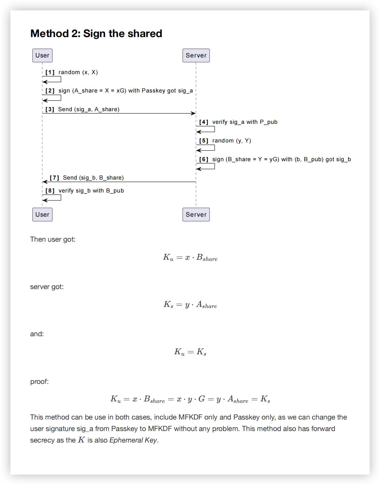

```plantuml
Participant User
Participant Frontend
Participant Backend
Participant Admin
title: 登录- <color #ff0000>临时公私钥对，像passkey的代理人一样，处理数据签名</color>


User->Frontend: 登录页面，输入work email邮箱
Frontend -> Backend: 获取challenge
Frontend -> Frontend:  <color #ff00ff>【可选：】</color><color #6CA6CD>计算real challenge: H (backend challenge + email + "login_action")</color>
   /'  group  Diffie-Hellman密钥交换
        Frontend -> Frontend: 生成公私钥对
        Frontend -> Frontend: passkey 签名(challenge + 公钥)
        Frontend -> Backend: 传递公钥 + 签名
        Backend -> Backend: 验证passkey签名
        Backend -> Backend: 生成服务端公私钥对
        Backend --> Backend: 服务端签名
        Backend -> Backend: 服务端生成共享密钥
        Backend -> Frontend: 返回服务端公钥、Token、签名
        Frontend --> Frontend: 前端验证服务端签名
        Frontend -> Frontend: 前端生成共享密钥
    end'/


    group #cddc39 Diffie-Hellman密钥交换 <color #ff00ff>参考： Sign the shared</color>
        Frontend -> Frontend: [1] random (x, X)
        Frontend -> Frontend: [2] sign (A_share = X = xG) with Passkey got sig_a
        Frontend -> Backend: [3] Send (sig_a, A_share)

        Backend -> Backend: [4] verify sig_a with P_pub
        Backend -> Backend: [5] random (y, Y)
        Backend -> Backend: [6] sign (B_share = Y = yG) with (b, B_pub) got sig_b
        Backend -> Backend: 计算共享密钥
        Backend -> Frontend: [7] Send (sig_b, B_share) <color #6CA6CD>and Token</color>
        Frontend -> Frontend: [8] verify sig_b with B_pub

        Frontend -> Frontend: 计算共享密钥
   
        end
    group  Diffie-Hellman 临时共享密钥进行通信
        Frontend <-> Backend: 业务请求，传递（签名/加密）
        Backend --> Backend: 验证Token有效性
        Backend --> Backend: 验证数据签名
        alt 成功
            Frontend <- Backend: 验证成功返回200状态码+数据
        else 某种失败
            Frontend <- Backend: 否则返回对应状态码
    end


end


```
## 参考

