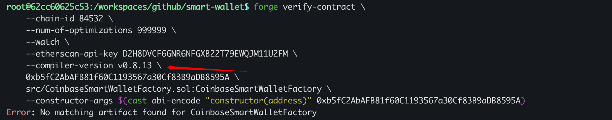
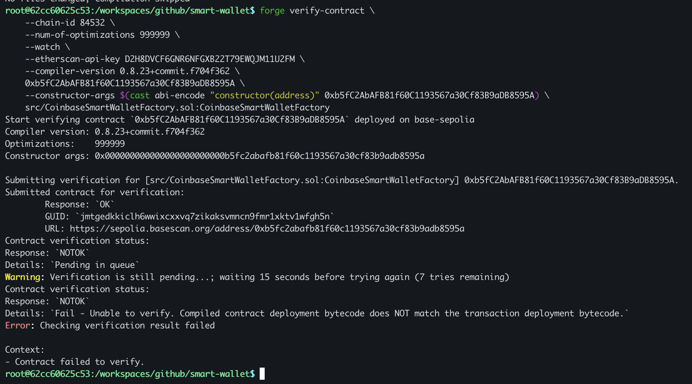
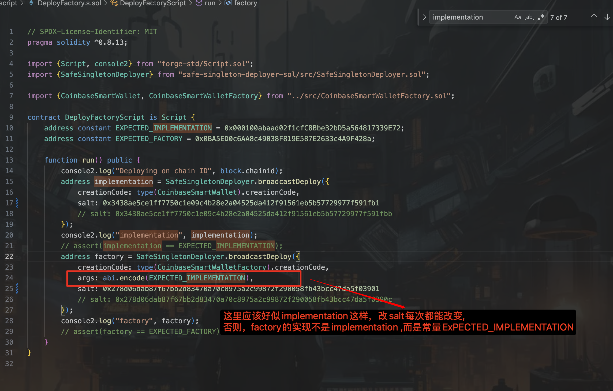
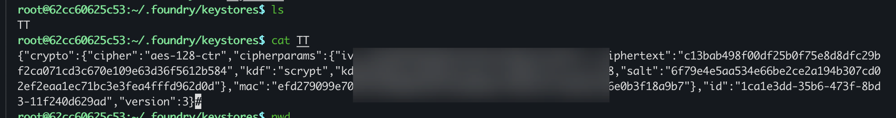

```
root@62cc60625c53:/workspaces/github/smart-wallet$ make deploy
bash -c 'source .env && export FOUNDRY_PROFILE=deploy && forge script script/DeployFactory.s.sol --rpc-url ${RPC_URL} --account ${ACCOUNT} --broadcast --verify'
[⠒] Compiling...
No files changed, compilation skipped
Enter keystore password:
Script ran successfully.

== Logs ==
  Deploying on chain ID 84532
  implementation 0xb5fC2AbAFB81f60C1193567a30Cf83B9aDB8595A
  factory 0x99712B4790DCf2E2b68358e8dE05E9C0d51037d7

## Setting up 1 EVM.

==========================

Chain 84532

Estimated gas price: 0.000810965 gwei

Estimated total gas used for script: 6056275

Estimated amount required: 0.000004911427055375 ETH

==========================

##### base-sepolia

✅  [Success] Hash: 0xff2031a0d7cbaa8c044664a1a38fb5404699ef629a31b149413f41df826f1717
Block: 23519989
Paid: 0.000003200898646611 ETH (3954319 gas * 0.000809469 gwei)

##### base-sepolia

✅  [Success] Hash: 0xffc0ab16deef540e8779108fdea9bcc9c3ec0f0e7f85577e84c2252aff575404
Block: 23519989
Paid: 0.00000032897629629 ETH (406410 gas * 0.000809469 gwei)

✅ Sequence #1 on base-sepolia | Total Paid: 0.000003529874942901 ETH (4360729 gas * avg 0.000809469 gwei)

==========================

ONCHAIN EXECUTION COMPLETE & SUCCESSFUL.
##
Start verification for (2) contracts
Start verifying contract `0xb5fC2AbAFB81f60C1193567a30Cf83B9aDB8595A` deployed on base-sepolia
Compiler version: 0.8.23
Optimizations:    999999

Submitting verification for [src/CoinbaseSmartWallet.sol:CoinbaseSmartWallet] 0xb5fC2AbAFB81f60C1193567a30Cf83B9aDB8595A.
Error: Encountered an error verifying this contract:
Response: `NOTOK`
Details:
                        `Invalid API Key (#err2)|BASE1-`
make: *** [Makefile:3: deploy] Error 1
root@62cc60625c53:/workspaces/github/smart-wallet$
```

## verify

```sh

forge verify-contract \
    --chain-id 84532 \
    --num-of-optimizations 999999 \
    --watch \
    --etherscan-api-key D2H8DVCF6GNR6NFGXB22T79EWQJM11U2FM \
    #  Error: No matching artifact found for CoinbaseSmartWalletFactory
    --compiler-version 0.8.23+commit.f704f362 \ 
    0xb5fC2AbAFB81f60C1193567a30Cf83B9aDB8595A \
    --constructor-args $(cast abi-encode "constructor(address)" 0xb5fC2AbAFB81f60C1193567a30Cf83B9aDB8595A) \
    src/CoinbaseSmartWalletFactory.sol:CoinbaseSmartWalletFactory

```

Artifact 一致性：

检查 `out/CoinbaseSmartWalletFactory.sol/CoinbaseSmartWalletFactory.json` 中的 compiler.version 字段

```
"compiler": {
  "version": "0.8.13+commit.abaa5c0e"
}
```

必须与 --compiler-version 参数完全一致（包括 commit hash）





## verify ok

```
root@62cc60625c53:/workspaces/github/smart-wallet$ make deploy
bash -c 'source .env && export FOUNDRY_PROFILE=deploy && forge script script/DeployFactory.s.sol --rpc-url ${RPC_URL} --account ${ACCOUNT} --broadcast --verify'
[⠊] Compiling...
[⠒] Compiling 34 files with Solc 0.8.23
[⠘] Solc 0.8.23 finished in 1.59s
Compiler run successful!
Enter keystore password:
Script ran successfully.

== Logs ==
  Deploying on chain ID 84532
  implementation 0x704641B16850B855c5Ad7ffC35FCC6753dfaE78F
  factory 0x167EE0B967DFbb432C06480fF09B86274aA07374

## Setting up 1 EVM.

==========================

Chain 84532

Estimated gas price: 0.0008869 gwei

Estimated total gas used for script: 6056275

Estimated amount required: 0.0000053713102975 ETH

==========================

##### base-sepolia

✅  [Success] Hash: 0xdc04aa7893fded888e7ef0cd9fdbfc1e738386138b2be40e0ea06cca37c64f92
Block: 23521350
Paid: 0.00000036011827536 ETH (406410 gas * 0.000886096 gwei)

##### base-sepolia

✅  [Success] Hash: 0xa05365d0791cbc8856ebed2bf68e3fc9dec2e12c9465e0bd7c608c35db324f0e
Block: 23521350
Paid: 0.000003503906248624 ETH (3954319 gas * 0.000886096 gwei)

✅ Sequence #1 on base-sepolia | Total Paid: 0.000003864024523984 ETH (4360729 gas * avg 0.000886096 gwei)

==========================

ONCHAIN EXECUTION COMPLETE & SUCCESSFUL.
##
Start verification for (2) contracts
Start verifying contract `0x704641B16850B855c5Ad7ffC35FCC6753dfaE78F` deployed on base-sepolia
Compiler version: 0.8.23
Optimizations:    999999

Submitting verification for [src/CoinbaseSmartWallet.sol:CoinbaseSmartWallet] 0x704641B16850B855c5Ad7ffC35FCC6753dfaE78F.
Submitted contract for verification:
	Response: `OK`
	GUID: `2sa3v6kxenbhawuaeqqn2an4jb5bza5l6ndkcuqb3gdftdfdx2`
	URL: https://sepolia.basescan.org/address/0x704641b16850b855c5ad7ffc35fcc6753dfae78f
Contract verification status:
Response: `NOTOK`
Details: `Pending in queue`
Warning: Verification is still pending...; waiting 15 seconds before trying again (7 tries remaining)
Contract verification status:
Response: `OK`
Details: `Pass - Verified`
Contract successfully verified
Start verifying contract `0x167EE0B967DFbb432C06480fF09B86274aA07374` deployed on base-sepolia
Compiler version: 0.8.23
Optimizations:    999999
Constructor args: 000000000000000000000000000100abaad02f1cfc8bbe32bd5a564817339e72

Submitting verification for [src/CoinbaseSmartWalletFactory.sol:CoinbaseSmartWalletFactory] 0x167EE0B967DFbb432C06480fF09B86274aA07374.
Submitted contract for verification:
	Response: `OK`
	GUID: `ctjnuvrsejwpwnpbvr83aw2zu4i4uh3lkhu47g41npt1pszm8a`
	URL: https://sepolia.basescan.org/address/0x167ee0b967dfbb432c06480ff09b86274aa07374
Contract verification status:
Response: `NOTOK`
Details: `Pending in queue`
Warning: Verification is still pending...; waiting 15 seconds before trying again (7 tries remaining)
Contract verification status:
Response: `OK`
Details: `Pass - Verified`
Contract successfully verified
All (2) contracts were verified!

Transactions saved to: /workspaces/github/smart-wallet/broadcast/DeployFactory.s.sol/84532/run-latest.json

Sensitive values saved to: /workspaces/github/smart-wallet/cache/DeployFactory.s.sol/84532/run-latest.json

```

## repeat verify

```
root@62cc60625c53:/workspaces/github/smart-wallet$ forge verify-contract \
    --chain-id 84532 \
    --num-of-optimizations 999999 \
    --watch \
    --etherscan-api-key D2H8DVCF6GNR6NFGXB22T79EWQJM11U2FM \
    --compiler-version v0.8.23+commit.f704f362 \
    0x704641B16850B855c5Ad7ffC35FCC6753dfaE78F \
    src/CoinbaseSmartWallet.sol:CoinbaseSmartWallet \
    --verifier-url https://api-sepolia.basescan.org/api
Start verifying contract `0x704641B16850B855c5Ad7ffC35FCC6753dfaE78F` deployed on base-sepolia
Compiler version: v0.8.23+commit.f704f362
Optimizations:    999999

Contract [src/CoinbaseSmartWallet.sol:CoinbaseSmartWallet] "0x704641B16850B855c5Ad7ffC35FCC6753dfaE78F" is already verified. Skipping verification.
root@62cc60625c53:/workspaces/github/smart-wallet$ forge verify-contract \
    --chain-id 84532 \
    --num-of-optimizations 999999 \
    --watch \
    --etherscan-api-key D2H8DVCF6GNR6NFGXB22T79EWQJM11U2FM \
    --compiler-version v0.8.23+commit.f704f362 \
    0x167EE0B967DFbb432C06480fF09B86274aA07374 \
    src/CoinbaseSmartWalletFactory.sol:CoinbaseSmartWalletFactory \
    --constructor-args 0x000000000000000000000000000100abaad02f1cfc8bbe32bd5a564817339e72 \
    --verifier-url https://api-sepolia.basescan.org/api
Start verifying contract `0x167EE0B967DFbb432C06480fF09B86274aA07374` deployed on base-sepolia
Compiler version: v0.8.23+commit.f704f362
Optimizations:    999999
Constructor args: 0x000000000000000000000000000100abaad02f1cfc8bbe32bd5a564817339e72

Contract [src/CoinbaseSmartWalletFactory.sol:CoinbaseSmartWalletFactory] "0x167EE0B967DFbb432C06480fF09B86274aA07374" is already verified. Skipping verification.
root@62cc60625c53:/workspaces/github/smart-wallet$
```

## 再次测试 verify fail 例子

```
forge verify-contract \
    --chain-id 84532 \
    --num-of-optimizations 999999 \
    --watch \
    --etherscan-api-key D2H8DVCF6GNR6NFGXB22T79EWQJM11U2FM \
    --compiler-version v0.8.23+commit.f704f362 \
    0xb5fC2AbAFB81f60C1193567a30Cf83B9aDB8595A \
    src/CoinbaseSmartWallet.sol:CoinbaseSmartWallet \
    --verifier-url https://api-sepolia.basescan.org/api

forge verify-contract \
    --chain-id 84532 \
    --num-of-optimizations 999999 \
    --watch \
    --etherscan-api-key D2H8DVCF6GNR6NFGXB22T79EWQJM11U2FM \
    --compiler-version v0.8.23+commit.f704f362 \
    0x99712B4790DCf2E2b68358e8dE05E9C0d51037d7 \
    src/CoinbaseSmartWalletFactory.sol:CoinbaseSmartWalletFactory \
    --constructor-args 0x000000000000000000000000000100abaad02f1cfc8bbe32bd5a564817339e72 \
    --verifier-url https://api-sepolia.basescan.org/api
```

失败原因找到了



## cast 命令执行以太坊交易

https://learnblockchain.cn/docs/foundry/i18n/zh/cast/index.html

```shell

$ cast wallet address --account TT

# Enter keystore password:
# 0xbB473eD8E0Aa12Ca409DFE4FEf4aB15e0d687da1
```

```shell

$ cast send --account TT 0x3c44cdddb6a900fa2b585dd299e03d12fa4293bc \
    $(cast from-utf8 "hello world") \
    --rpc-url https://sepolia.base.org

# Enter keystore password:
# 
# blockHash            0x1792060d6041cbb9348b1379ce6b939355f2e7cb329214954d02a46c22f2f8d4
# blockNumber          23522063
# contractAddress
# cumulativeGasUsed    8558725
# effectiveGasPrice    886059
# from                 0xbB473eD8E0Aa12Ca409DFE4FEf4aB15e0d687da1
# gasUsed              21176
# logs                 []
# logsBloom            0x00000000000000000000000000000000000000000000000000000000000000000000000000000000000000000000000000000000000000000000000000000000000000000000000000000000000000000000000000000000000000000000000000000000000000000000000000000000000000000000000000000000000000000000000000000000000000000000000000000000000000000000000000000000000000000000000000000000000000000000000000000000000000000000000000000000000000000000000000000000000000000000000000000000000000000000000000000000000000000000000000000000000000000000000000000000
# root
# status               1 (success)
# transactionHash      0xd9e8fc21a1e8e5e5625691243e8dafd306776e9c00779abf430634ee61b05ec1
# transactionIndex     42
# type                 2
# blobGasPrice
# blobGasUsed
# authorizationList
# to                   0x3C44CdDdB6a900fa2b585dd299e03d12FA4293BC
# l1BaseFeeScalar      1101
# l1BlobBaseFee        1
# l1BlobBaseFeeScalar  659851
# l1Fee                30622672
# l1GasPrice           17383405
# l1GasUsed            1600

# tx: https://sepolia.basescan.org/tx/0xd9e8fc21a1e8e5e5625691243e8dafd306776e9c00779abf430634ee61b05ec1

```

## cast

在 Linux 上， `--account TT` 需要对应一个已配置的账户。你可以使用 **Foundry ( `cast` ) 的 keystore** 来管理账户，并通过 `TT` 这个 alias 访问它。  

---

### **📌 `TT` 账户存储在哪里？**

在 Linux 上，Foundry ( `cast` ) 默认会将 keystore 存储在：

```bash
~/.foundry/keystores # 这里gpt会写错 ~/.foundry/keystore
```

你可以检查这个目录，看看是否有 `TT` 账户的 keystore 文件。

---

### **✅ 如何检查 `TT` 账户是否存在？**

运行以下命令：

```bash
cast wallet list
```

如果 `TT` 账户已经正确配置，你应该能看到类似：

```
TT: 0xbB473eD8E0Aa12Ca409DFE4FEf4aB15e0d687da1
```

如果 `TT` 账户没有列出，说明它可能没有正确导入。

---

### **✅ 如何导入 `TT` 账户？**

如果 `TT` 账户不存在，你可以使用私钥导入：

```bash
cast wallet import --alias TT --private-key <你的私钥>
```

或者，如果你有 keystore 文件：

```bash
cast wallet import --alias TT --keystore <keystore 文件路径>
```

然后再次运行：

```bash
cast wallet list
```

确认 `TT` 账户是否存在。

---

### **✅ 如何使用 `TT` 账户发送交易？**

如果 `TT` 账户已经正确配置，你可以这样发送交易：

```bash
cast send --account TT 0x3c44cdddb6a900fa2b585dd299e03d12fa4293bc \
    $(cast from-utf8 "hello world") \
    --rpc-url https://sepolia.base.org
```

---

### **🚀 你的下一步**

1. **运行 `cast wallet list`**，检查 `TT` 是否存在。
2. **如果 `TT` 不存在，使用 `cast wallet import` 导入账户**。
3. **确认后，运行 `cast send --account TT ...` 发送交易**。
4. **如果有错误，提供错误信息，我来帮你解决！** 🚀

## 找钱包



## balance

```bash
$ cast balance $(cast wallet address --account TT)

# Enter keystore password:
# Error: error sending request for url (http://localhost:8545/)

# Context:
# - Error #0: client error (Connect)
# - Error #1: tcp connect error: Connection refused (os error 111)

$ cast balance $(cast wallet address --account TT) --rpc-url https://sepolia.base.org

# Enter keystore password:
# 9992585439895116
# root@62cc60625c53:/workspaces/github/smart-wallet$
```
