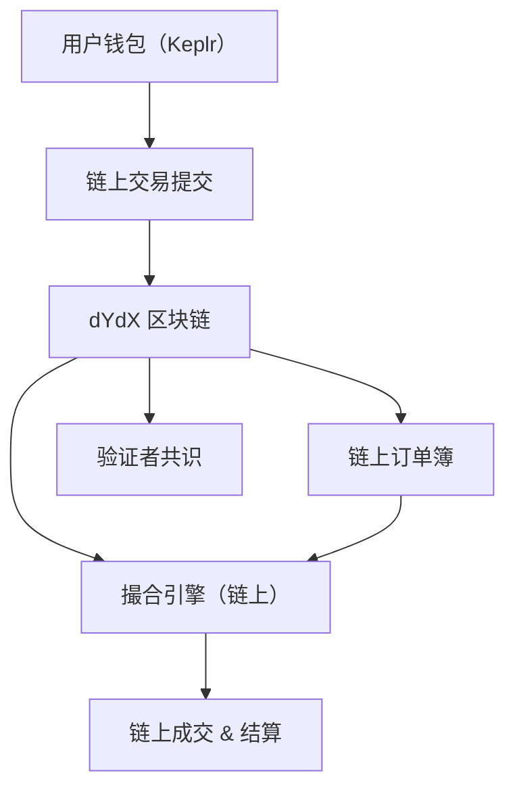

# dydx既具有交易所特性，又具有链的特性？
是的！你说得非常准确，dYdX 既具有 **交易所的特性**，又具有 **区块链的特性**，它是一个非常特别的“混合体”。

我们可以把它理解为：

> 🧬 **“交易所 + 区块链 = dYdX v4”**

---

## 🔍 一图看懂 dYdX 的双重身份

| 特性类别     | 内容               | dYdX 是否具备 | 说明                           |
| ------------ | ------------------ | ------------- | ------------------------------ |
| 🏦 交易所特性 | 订单簿撮合机制     | ✅ 有          | 像币安一样的限价单/市价单      |
| 🏦 交易所特性 | Maker/Taker 手续费 | ✅ 有          | 挂单返佣、吃单收费             |
| 🏦 交易所特性 | 永续合约交易       | ✅ 有          | 支持杠杆、做多做空             |
| 🏦 交易所特性 | 高性能撮合         | ✅ 有          | 使用链上订单簿 + 验证者共识    |
| ⛓️ 区块链特性 | 完全链上运行       | ✅ 有          | 所有交易都在 dYdX 链上执行     |
| ⛓️ 区块链特性 | 自有代币（DYDX）   | ✅ 有          | 用于质押、治理、Gas 支付等     |
| ⛓️ 区块链特性 | 验证者共识机制     | ✅ 有          | 基于 Cosmos SDK 构建，采用 PoS |
| ⛓️ 区块链特性 | 钱包签名交易       | ✅ 有          | 用 Keplr、Leap 等钱包操作      |
| ⛓️ 区块链特性 | 支付 Gas 费用      | ✅ 有          | 每笔交易都需支付少量 Gas       |

---

## 🧠 简单理解：

### ✅ dYdX 是一个“链上交易所”

- 它不是部署在以太坊主网上的一个 DApp（像 Uniswap）
- 它是一个 **独立的区块链（Cosmos SDK 构建）**
- 所有交易（挂单、撤单、成交、清算）都是区块链上的交易

---

## 🔧 技术架构图（简化版）

---

## 📌 和其他交易平台的对比

| 项目        | 是否是链 | 是否是交易所 | 撮合方式 | 是否链上执行 | 是否需要 Gas |
| ----------- | -------- | ------------ | -------- | ------------ | ------------ |
| **dYdX v4** | ✅ 是链   | ✅ 是交易所   | 订单簿   | ✅ 是         | ✅ 有         |
| Uniswap     | ❌ 不是链 | ✅ 是 DEX     | AMM      | ✅ 是         | ✅ 有         |
| Binance     | ❌ 不是链 | ✅ 是 CEX     | 订单簿   | ❌ 否         | ❌ 无         |
| Injective   | ✅ 是链   | ✅ 是交易所   | 订单簿   | ✅ 是         | ✅ 有         |

---

## 🧠 总结一句话：

> **dYdX v4 是一个运行在自己区块链上的去中心化合约交易所，融合了中心化交易体验与区块链安全性。**

---

如果你想进一步了解：

- dYdX 的链是怎么运行的？
- 验证者怎么参与？DYDX 代币如何质押？
- 和 Injective、Osmosis、Sei 等链有何不同？

我也可以继续为你展开讲解 😄

是否想了解 dYdX 的链级设计或代币经济？

# dydx 和  Injective 订单簿撮合是否开源？

非常好的问题！dYdX 和 Injective 都是基于 Cosmos SDK 构建的链上订单簿交易平台，它们都实现了链上撮合系统。但它们在 **订单簿撮合引擎的开源程度、架构设计、执行方式** 等方面存在一些差异。

下面我将从以下几个维度来对比说明：

---

## 📂 1. 是否开源？

| 项目          | 订单簿撮合是否开源？                     | 撮合执行位置 | 开源地址                                                                                   |
| ------------- | ---------------------------------------- | ------------ | ------------------------------------------------------------------------------------------ |
| **dYdX v4**   | ✅ **部分开源**（核心撮合逻辑未完全开源） | 链上执行     | [github.com/dydxprotocol/v4-chain](https://github.com/dydxprotocol/v4-chain)               |
| **Injective** | ✅ **完全开源**                           | 链上执行     | [github.com/InjectiveLabs/injective-core](https://github.com/InjectiveLabs/injective-core) |

---

## 🔍 2. dYdX v4 的开源情况

- dYdX v4 是一个完全链上运行的订单簿衍生品交易所，其核心链代码已经 **部分开源**。
- 开源内容包括：
  - Cosmos SDK 模块（如交易、撮合、清算、资金费率等）
  - 区块链逻辑、状态管理、验证者机制
- 撮合引擎的核心逻辑虽然在链上执行，但其实现细节（如撮合速度优化、排序算法）并**未全部开源**。

📌 官方 GitHub：
> https://github.com/dydxprotocol/v4-chain

---

## 🔍 3. Injective 的开源情况

- Injective 是 Cosmos 上的链上订单簿平台，**核心撮合引擎完全开源**。
- 它的链上模块包括：
  - `exchange` 模块：链上订单簿、撮合、结算
  - `oracle` 模块：预言机价格
  - `auction` 模块：链上清算竞拍
- 所有撮合和订单簿逻辑都在链上执行，代码可查可复现。

📌 官方 GitHub：
> https://github.com/InjectiveLabs/injective-core

---

## ⚙️ 4. 撮合机制对比简述

| 项目      | 撮合执行位置     | 撮合引擎开源程度 | 撮合频率   | 备注                               |
| --------- | ---------------- | ---------------- | ---------- | ---------------------------------- |
| dYdX v4   | 链上（每个区块） | ❗部分开源        | 每区块一次 | 高性能链上订单簿                   |
| Injective | 链上（每个区块） | ✅ 完全开源       | 每区块一次 | 使用 batch auction（批量撮合）机制 |

---

## 🧠 小知识：什么是链上订单簿撮合？

> 链上撮合 = 所有挂单、撤单、成交都需要发送链上交易，经过共识验证，公开透明，无法篡改。

优点：
- 去中心化
- 可验证
- 公平透明

缺点：
- 撮合速度受限于区块时间
- 每笔操作都要支付 Gas

---

## ✅ 总结

| 项目          | 撮合是否开源 | 撮合执行方式 | 代码可信度           | 拓展性 |
| ------------- | ------------ | ------------ | -------------------- | ------ |
| **dYdX v4**   | ✅ 部分开源   | 链上撮合     | 高（但核心未全开源） | 高     |
| **Injective** | ✅ 完全开源   | 链上撮合     | 非常高               | 高     |

---

如果你是开发者或研究者，想深入研究链上订单簿逻辑，我推荐从 **Injective 的 `exchange` 模块源码** 入手，它结构清晰、文档较全。

如果你对 dYdX 的链上撮合机制感兴趣，我也可以帮你解析它的模块结构、交易流程，甚至画出模块依赖图。需要我做这个吗？😄

