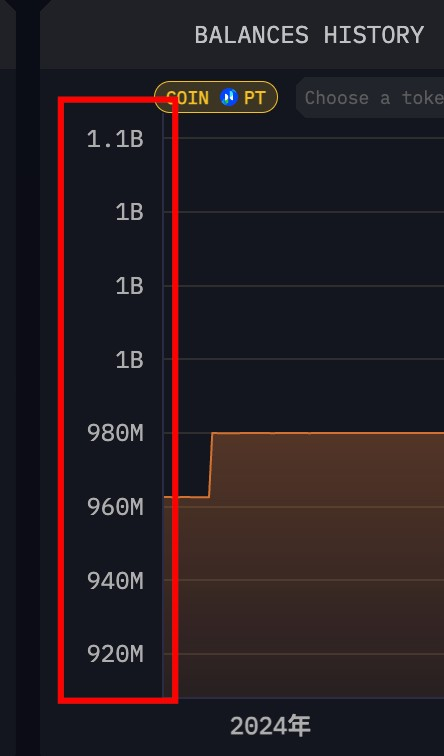

## price 单位



要在图表中实现自定义的刻度标签格式（如图中的“1.1B”、“980M”），可以使用图表库的刻度标签格式化功能。以下是如何使用 `lightweight-charts` 库实现这一功能的示例：

### 使用 `lightweight-charts`

1. **创建图表和系列：**

   首先，创建图表并添加一个系列。

2. **自定义刻度标签格式：**

   使用 `priceScale` 的 `formatters` 属性来定义自定义格式化函数。

```javascript
import React, {
    useEffect,
    useRef
} from 'react';
import {
    createChart
} from 'lightweight-charts';

const ChartComponent = () => {
    const chartContainerRef = useRef(null);

    useEffect(() => {
        if (chartContainerRef.current) {
            const chart = createChart(chartContainerRef.current, {
                width: 600,
                height: 400,
                layout: {
                    textColor: 'white',
                    background: {
                        type: 'solid',
                        color: '#1c1c1e'
                    },
                },
                rightPriceScale: {
                    visible: true,
                    borderVisible: false,
                },
                timeScale: {
                    borderVisible: false,
                },
            });

            const lineSeries = chart.addLineSeries({
                color: '#2962FF',
            });

            lineSeries.setData([{
                    time: '2024-01-01',
                    value: 1100000000
                },
                {
                    time: '2024-02-01',
                    value: 1000000000
                },
                {
                    time: '2024-03-01',
                    value: 980000000
                },
                {
                    time: '2024-04-01',
                    value: 960000000
                },
                {
                    time: '2024-05-01',
                    value: 940000000
                },
                {
                    time: '2024-06-01',
                    value: 920000000
                },
            ]);

            // 自定义刻度标签格式化
            chart.priceScale('right').applyOptions({
                scaleMargins: {
                    top: 0.1,
                    bottom: 0.1,
                },
                borderVisible: false,
                mode: 1, // Logarithmic scale
                formatters: {
                    priceFormatter: (price) => {
                        if (price >= 1e9) {
                            return (price / 1e9).toFixed(1) + 'B';
                        } else if (price >= 1e6) {
                            return (price / 1e6).toFixed(0) + 'M';
                        }
                        return price.toString();
                    },
                },
            });

            return () => {
                chart.remove();
            };
        }
    }, []);

    return <div ref = {
        chartContainerRef
    }
    style = {
        {
            width: '100%',
            height: '400px'
        }
    }
    />;
};

export default ChartComponent;
```

### 说明

* **`priceFormatter`**: 自定义价格格式化函数，用于将刻度标签格式化为“B”（十亿）或“M”（百万）。
* **`applyOptions`**: 用于应用自定义的刻度标签格式。

### 注意

确保安装了 `lightweight-charts` 库，并在项目中正确导入。此示例假设数据是以十亿为单位的数值，可以根据需要调整数据和格式化逻辑。
