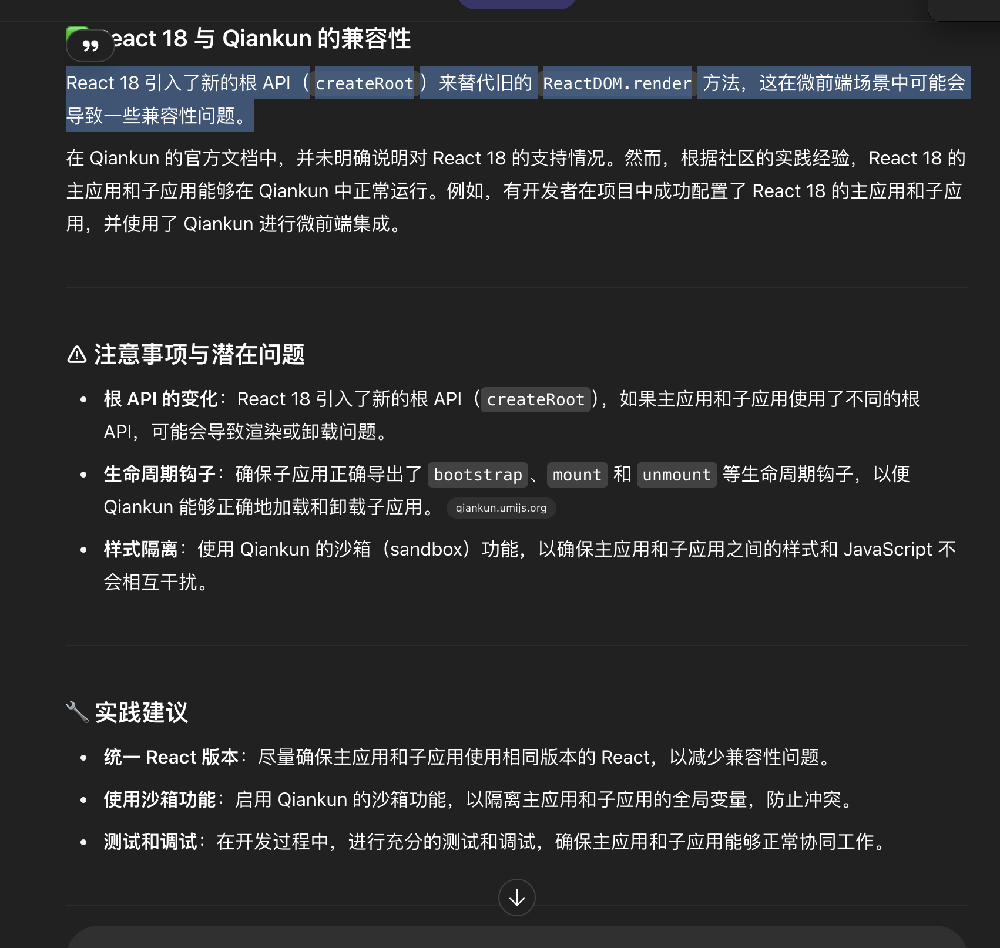

## 微前端技术方案对比，选择一个好的微前端方案，并回答选择的原因


在选择微前端技术方案时，需要从**架构灵活性、团队协作、技术栈兼容、部署独立性、性能影响**等多个维度进行对比。下面是主流微前端方案的对比和最终推荐。

---

## 🔍 主流微前端方案对比

| 方案                                 | 原理                             | 优点                                                                   | 缺点                                        | 适用场景                       |
| ------------------------------------ | -------------------------------- | ---------------------------------------------------------------------- | ------------------------------------------- | ------------------------------ |
| **1. iframe 嵌套**                   | 每个子应用运行在独立 iframe 中   | - 强隔离，互不干扰<br>- 技术栈完全独立                                 | - 性能差（渲染慢）<br>- 通信复杂<br>- SEO差 | 极高隔离要求、安全级别高的系统 |
| **2. 基于路由拆分（如 qiankun）**    | 主应用管理路由，子应用按路由加载 | - 支持子应用独立部署<br>- 技术栈自由<br>- 生命周期完整                 | - 初始化略慢<br>- 样式冲突需额外处理        | 中大型平台型应用               |
| **3. 模块联邦（Module Federation）** | Webpack 5 提供的模块共享机制     | - 更快加载（运行时共享依赖）<br>- 适合团队协作<br>- 原生支持微服务架构 | - 初始配置复杂<br>- 仅支持 Webpack 构建体系 | 前后端一体协作开发的大型项目   |
| **4. Web Component 组合**            | 通过 Custom Elements 封装子应用  | - 封装性好<br>- 可用任何框架实现                                       | - 状态管理和通信复杂<br>- SEO 与 SSR 支持差 | 前端组件库平台、轻微前端项目   |
| **5. Single SPA**                    | 实现微前端协议的框架             | - 灵活组合多个框架<br>- 社区活跃                                       | - 手动集成麻烦<br>- 生态不如 qiankun        | 多技术栈共存但需低耦合管理     |

---

## ✅ 推荐方案：**基于路由拆分的微前端方案（如 [qiankun](https://qiankun.umijs.org/)）**

### 🧠 推荐原因：

1. **成熟稳定，生态好**

   * `qiankun` 基于 `Single SPA` 封装，社区维护良好，文档齐全，企业应用多。

2. **技术栈灵活**

   * 子应用可以是 React、Vue、Angular 或纯 JS 编写，互不干扰。

3. **支持独立部署与版本管理**

   * 每个子应用可由独立团队开发、构建、部署，有利于 CI/CD。

4. **完善的生命周期管理**

   * 提供 `beforeLoad`、`mounted`、`unmounted` 等钩子，便于统一管理加载状态。

5. **通信机制成熟**

   * 提供 `props`、`globalState` 等方式支持主子通信。

6. **SSR 支持和性能优化空间大**

   * qiankun 支持预加载策略、异步懒加载，优化首次渲染性能。

---

## 🔧 使用 qiankun 的典型架构图（简化）

```
主应用（基座）
│
├── 路由管理（vue-router / react-router）
│
├── 微前端管理（qiankun）
│   ├── 子应用 A（React）
│   ├── 子应用 B（Vue）
│   └── 子应用 C（Angular）
│
└── 全局通信（事件中心 / Vuex / Redux shared）
```

---

## 🎯 总结

| 指标         | 分数（满分5） |
| ------------ | ------------- |
| 技术成熟度   | ⭐⭐⭐⭐⭐         |
| 技术栈兼容性 | ⭐⭐⭐⭐⭐         |
| 团队协作适配 | ⭐⭐⭐⭐⭐         |
| 性能优化空间 | ⭐⭐⭐⭐          |
| 上手难度     | ⭐⭐⭐           |

**结论：对于绝大多数中大型企业级系统，推荐使用基于 `qiankun` 的路由拆分型微前端方案**，能够很好地平衡性能、开发效率和团队协作。

如果你有具体的项目背景，我可以进一步定制推荐。


## qiankun vs wujie

很好，现在我们来 **深入对比 `qiankun` 和 `wujie`** 这两个微前端框架，帮助你判断哪个更适合你的项目场景。

---

## 🧩 qiankun vs wujie 对比分析

| 维度           | [qiankun](https://qiankun.umijs.org/)       | [wujie](https://github.com/Tencent/wujie) |
| -------------- | ------------------------------------------- | ----------------------------------------- |
| **开发者**     | 阿里巴巴                                    | 腾讯                                      |
| **架构原理**   | 基于 `single-spa`，使用沙箱隔离 + 路由控制  | 使用 iframe-like 方式实现沙箱 + 快速切换  |
| **性能表现**   | 加载性能一般，依赖子应用注册和沙箱重建      | 快速挂载、切换性能更好（保留 DOM 实例）   |
| **沙箱机制**   | 快照式沙箱（内存快照）或 Shadow DOM + Proxy | iframe-like DOM 沙箱（更彻底隔离）        |
| **通信方式**   | 支持 props 传递、全局状态共享、EventBus     | 提供简单的 publish / subscribe 接口       |
| **资源隔离**   | 样式/JS 需自行处理冲突                      | 资源隔离好（默认每个子应用有独立环境）    |
| **兼容性**     | 支持主流前端框架                            | 更容易支持多种框架（也支持无框架）        |
| **支持 SSR**   | 不原生支持 SSR，需要手动处理                | 不支持 SSR                                |
| **社区活跃度** | 较高，UMI 官方生态                          | 稍低，但文档清晰，腾讯维护                |
| **子应用保活** | 默认卸载时销毁（可预加载）                  | 支持子应用「保活」，切换更快              |

---

## 📌 核心对比亮点

| 特性             | 更优方案      | 原因                                   |
| ---------------- | ------------- | -------------------------------------- |
| **加载速度**     | ✅ **Wujie**   | 子应用可「保活」+ 不重建实例，切换更快 |
| **技术成熟度**   | ✅ **qiankun** | 更早发布 + 社区活跃，文档和企业使用多  |
| **沙箱隔离强度** | ✅ **Wujie**   | iframe-like 方式，更接近原生隔离环境   |
| **使用灵活性**   | ✅ **qiankun** | 生命周期更全，细粒度控制能力强         |
| **简单易用性**   | ✅ **Wujie**   | 更少的接入代码，上手快                 |
| **复杂项目支持** | ✅ **qiankun** | 对状态管理、权限控制、路由有更好支持   |

---

## ✅ 结论：选择建议

| 场景                                     | 推荐方案      | 原因                                 |
| ---------------------------------------- | ------------- | ------------------------------------ |
| **大中型平台系统（多团队、多框架）**     | **qiankun** ✅ | 生命周期完善，灵活性高，文档社区成熟 |
| **中轻量级项目（追求切换速度、上线快）** | **wujie** ✅   | 简单快速接入、性能优越、强隔离       |
| **子应用数量多，频繁切换**               | **wujie** ✅   | 支持保活，切换不重建                 |
| **强调技术栈混合与部署独立**             | **qiankun** ✅ | 支持不同技术栈共存、构建部署更自由   |

---

## 📊 总体推荐

> 如果你是**企业级项目、技术要求高、团队协作复杂**：**选择 `qiankun`**
>
> 如果你追求**加载速度快、集成简单、部署灵活性略低也可接受**：**选择 `wujie`**

---

如果你能告诉我你的具体业务场景，比如是否多团队协作、是否跨框架、是否要求子应用保活等，我可以为你推荐更具体的方案（如 qiankun + keepAlive 实现方案，或者基于 wujie 的快速部署模板）。是否需要？

## qiankun 对 vite 支持不够好


是的，✅ **`qiankun` 可以和 `Vite` 搭配使用**，不过需要做一些**兼容性处理**，因为：

> `qiankun` 是基于 `UMD 模块格式 + HTML Entry` 的微前端框架，最初为 Webpack 而设计，而 `Vite` 默认产出的是 `ESM` 模块。

---

## 🛠 使用 Vite + qiankun 的核心挑战

| 问题                      | 原因                                                     |
| ------------------------- | -------------------------------------------------------- |
| 🔧 子应用不导出 `UMD` 模块 | Vite 默认打包成 `ES Module`                              |
| 🔧 样式隔离不生效          | qiankun 的样式隔离策略在 vite 项目中需手动开启 CSS Scope |
| 🔧 开发模式不支持沙箱      | 需要 vite 插件支持 `__webpack_public_path__` 等替代方案  |

---

## ✅ 解决方案：vite 项目中接入 qiankun（子应用）

### 1. 配置 `vite.config.ts` 为 `UMD` 格式

```ts
// vite.config.ts
import { defineConfig } from 'vite'
import vue from '@vitejs/plugin-vue'

export default defineConfig({
  plugins: [vue()],
  base: '/', // qiankun 要求资源路径为相对路径
  build: {
    target: 'esnext',
    outDir: 'dist',
    assetsDir: 'static',
    sourcemap: true,
    lib: {
      entry: 'src/main.ts',
      name: 'MyApp',
      formats: ['umd'],
      fileName: 'my-app',
    },
    rollupOptions: {
      output: {
        globals: {
          vue: 'Vue',
        },
      },
    },
  },
})
```

### 2. 子应用暴露 qiankun 生命周期函数

```ts
// src/main.ts

import { createApp } from 'vue'
import App from './App.vue'

let app: any

function render(props: any = {}) {
  const { container } = props
  app = createApp(App)
  app.mount(container ? container.querySelector('#app') : '#app')
}

if (!(window as any).__POWERED_BY_QIANKUN__) {
  render()
}

export async function bootstrap() {
  console.log('子应用 bootstrap')
}

export async function mount(props: any) {
  console.log('子应用 mount')
  render(props)
}

export async function unmount() {
  console.log('子应用 unmount')
  app.unmount()
}
```

### 3. HTML 模板配置（支持 HTML Entry）

确保 `index.html` 包含：

```html
<div id="app"></div>
<script type="module" src="/src/main.ts"></script>
```

---

## 🔗 主应用使用 qiankun 加载 vite 子应用

```ts
import { registerMicroApps, start } from 'qiankun'

registerMicroApps([
  {
    name: 'vite-app',
    entry: '//localhost:5173', // vite 子应用本地地址
    container: '#subapp-container',
    activeRule: '/vite',
  }
])

start({
  sandbox: {
    strictStyleIsolation: false // 或 true，取决于是否开启 Shadow DOM
  }
})
```

---

## ✅ 常见问题说明

| 问题                           | 解决方法                                                        |
| ------------------------------ | --------------------------------------------------------------- |
| 无法热更新                     | vite 默认不适配沙箱热更新，开发推荐关闭 sandbox 或用 dev server |
| 样式不隔离                     | 可以用 `scoped` 或启用 qiankun 的 `strictStyleIsolation`        |
| `__webpack_public_path__` 报错 | 可使用 `vite-plugin-qiankun` 自动注入公共路径                   |

---

## 🚀 可选插件推荐

* [`vite-plugin-qiankun`](https://github.com/umijs/qiankun/tree/master/examples/vite)：官方示例插件（维护中）
* [`vite-plugin-single-spa`](https://github.com/matteobruni/vite-plugin-single-spa)：适合用于 qiankun / single-spa 子应用打包

---

## ✅ 总结

| 项目                     | 是否支持                            |
| ------------------------ | ----------------------------------- |
| Vite 开发 qiankun 子应用 | ✅ 支持（需配置）                    |
| qiankun 主应用使用 Vite  | ✅ 支持（但更常见的是 webpack）      |
| 热更新支持               | 🟡 有一定限制，推荐 dev 模式关闭沙箱 |
| ESM 支持                 | 🟡 默认不兼容，需打包为 UMD 模块     |

---

如果你想，我可以直接给你生成一个 `Vite + qiankun 子应用模版项目结构`，是否需要？


## wujie对vite 支持好


是的，✅ **Wujie 原生支持 Vite**，而且比 qiankun 更友好，因为它不依赖 Webpack 的特殊产物（如 UMD 格式、`__webpack_public_path__` 等），所以：

> 👉 **你可以用 Vite 开发和构建子应用，无需做复杂打包 hack，也不强制要求使用 UMD 格式。**

---

## 🛠 使用 Vite + Wujie（子应用）超简单

### ✅ 一、子应用 vite 项目配置

你可以照常使用 Vite 脚手架：

```bash
npm create vite@latest my-subapp --template vue
cd my-subapp
npm install
```

不需要像 qiankun 一样配置 `lib/umd` 等参数，直接用即可。

---

### ✅ 二、子应用入口 `main.ts` 支持 Wujie props

Wujie 会将共享数据注入到 `window.__WUJIE`：

```ts
import { createApp } from 'vue'
import App from './App.vue'

const app = createApp(App)

// 接收主应用传过来的 props
if (window.__WUJIE?.props) {
  const props = window.__WUJIE.props
  app.config.globalProperties.$propsFromMain = props
}

app.mount('#app')
```

---

### ✅ 三、主应用加载 Vite 子应用

```ts
import Wujie from 'wujie-web'

Wujie.mountApp({
  name: 'vite-subapp',
  url: 'http://localhost:5173',
  el: '#vite-container',
  props: {
    token: 'abc123',
    onEvent: () => console.log('事件来自主应用')
  },
  alive: true,  // 支持保活，避免重复加载
})
```

---

## 📦 不需要配置的东西（对比 qiankun）

| 兼容项                         | qiankun 需要配置                         | wujie 是否需要        |
| ------------------------------ | ---------------------------------------- | --------------------- |
| UMD 打包                       | ✅ 必须手动设置 Vite 输出为 `lib` + `umd` | ❌ 不需要              |
| 设置 `__webpack_public_path__` | ✅ 必须                                   | ❌ 不需要              |
| 支持 HTML Entry                | ✅ 支持但繁琐                             | ✅ 默认支持 HTML entry |
| 动态资源注入兼容               | 手动处理                                 | ✅ 默认支持            |

---

## ✅ Wujie + Vite 子应用优势

| 特性          | 是否支持 | 说明                         |
| ------------- | -------- | ---------------------------- |
| 默认支持 Vite | ✅        | 无需特殊配置                 |
| 热更新（HMR） | ✅        | 开发环境秒开、自动刷新       |
| 构建优化      | ✅        | 使用原生 ESBuild，速度快     |
| 沙箱隔离      | ✅        | 独立上下文，样式 JS 不冲突   |
| 主子通信      | ✅        | 使用 `props` 或 `$wujie.bus` |

---

## 📁 示例目录结构

```
my-vite-subapp/
├── public/
├── src/
│   └── main.ts      <-- 正常挂载即可
├── index.html       <-- 正常开发，无需额外配置
├── vite.config.ts   <-- 默认 vite 配置
```

---

## ✅ 总结

| 项目                  | Wujie 对 Vite 的支持情况  |
| --------------------- | ------------------------- |
| Vite 子应用开发       | ✅ 完全支持，无需打包 hack |
| Vite 构建产物兼容性   | ✅ 支持原生 ESModule       |
| 主子通信              | ✅ 使用 props 和事件总线   |
| 子应用热更新          | ✅ 开发体验好              |
| 相比 qiankun 简化程度 | 🏆 显著简化                |

---

如果你想，我可以为你生成一个最小可运行的 **Wujie + Vite 子应用模版工程**（Vue 或 React 均可），是否需要？

## react api变更影响


React 18 引入了新的根 API（createRoot）来替代旧的 ReactDOM.render 方法，这在微前端场景中可能会导致一些兼容性问题。


