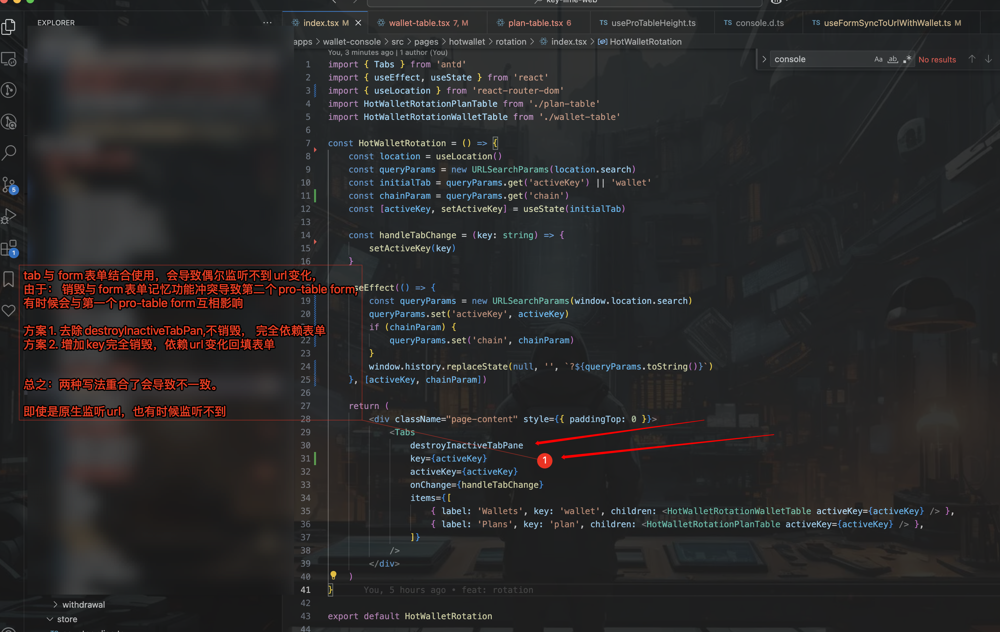

```tsx
import { Tabs } from 'antd'
import { useEffect, useState } from 'react'
import { useLocation } from 'react-router-dom'
import HotWalletRotationPlanTable from './plan-table'
import HotWalletRotationWalletTable from './wallet-table'

const HotWalletRotation = () => {
	const location = useLocation()
	const queryParams = new URLSearchParams(location.search)
	const initialTab = queryParams.get('activeKey') || 'wallet'
	const chainParam = queryParams.get('chain')
	const [activeKey, setActiveKey] = useState(initialTab)

	const handleTabChange = (key: string) => {
		setActiveKey(key)
	}

	useEffect(() => {
		const queryParams = new URLSearchParams(window.location.search)
		queryParams.set('activeKey', activeKey)
		if (chainParam) {
			queryParams.set('chain', chainParam)
		}
		window.history.replaceState(null, '', `?${queryParams.toString()}`)
	}, [activeKey, chainParam])

	return (
		<div className="page-content" style={{ paddingTop: 0 }}>
			<Tabs
				destroyInactiveTabPane
				key={activeKey}
				activeKey={activeKey}
				onChange={handleTabChange}
				items={[
					{ label: 'Wallets', key: 'wallet', children: <HotWalletRotationWalletTable activeKey={activeKey} /> },
					{ label: 'Plans', key: 'plan', children: <HotWalletRotationPlanTable activeKey={activeKey} /> },
				]}
			/>
		</div>
	)
}

export default HotWalletRotation

```
