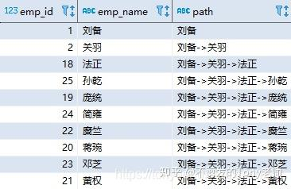

## 如何获取员工在公司组织结构中的结构图，也就是从最高领导到员工的管理路径？

这种查询特别适合展示组织结构，帮助理解每个员工在公司结构中的位置。

```sql
WITH RECURSIVE employee_paths (emp_id, emp_name, path) AS
(
  SELECT emp_id, emp_name, CAST(emp_name AS CHAR(200))
    FROM employee
    WHERE manager IS NULL -- 初始化递归的锚点
  UNION ALL
  SELECT e.emp_id, e.emp_name, CONCAT(ep.path, '->', e.emp_name)
    FROM employee_paths ep -- 开启递归
    JOIN employee e
      ON ep.emp_id = e.manager
)
SELECT * FROM employee_paths ORDER BY path;
```



当然，这个查询使用了递归公用表表达式（CTE）来构建员工的管理层路径。下面是对其的详细解释：

### 查询的结构

1. **递归 CTE 定义**：
   - `WITH RECURSIVE employee_paths (emp_id, emp_name, path) AS (...)`

2. **初始查询（锚点部分）**：
   - `SELECT emp_id, emp_name, CAST(emp_name AS CHAR(200)) FROM employee WHERE manager IS NULL`

   - 选择没有经理的员工（通常是最高管理层），并初始化路径为员工姓名。

3. **递归部分**：
   - `UNION ALL`

   - `SELECT e.emp_id, e.emp_name, CONCAT(ep.path, '->', e.emp_name) FROM employee_paths ep JOIN employee e ON ep.emp_id = e.manager`

   - 通过联接，将当前路径扩展到直接下属。路径通过 `CONCAT` 函数连接。

4. **最终选择**：
   - `SELECT * FROM employee_paths ORDER BY path`

   - 返回所有员工的管理路径，并按路径排序。

### 解释每一步

* **初始查询**：
  + 找到所有没有经理的员工（顶级管理者）。
  + 初始化路径为该员工的名字。

* **递归查询**：
  + 对于每个找到的路径，查找直接下属。
  + 将下属的名字附加到路径上。
  + 继续递归，直到所有的员工都被处理完。

* **排序**：
  + 最终结果按路径排序，便于查看每个员工的完整管理层路径。

### 使用场景

这种查询特别适合展示组织结构，帮助理解每个员工在公司结构中的位置。

如果还有其他问题或需要进一步解释，请告诉我！
