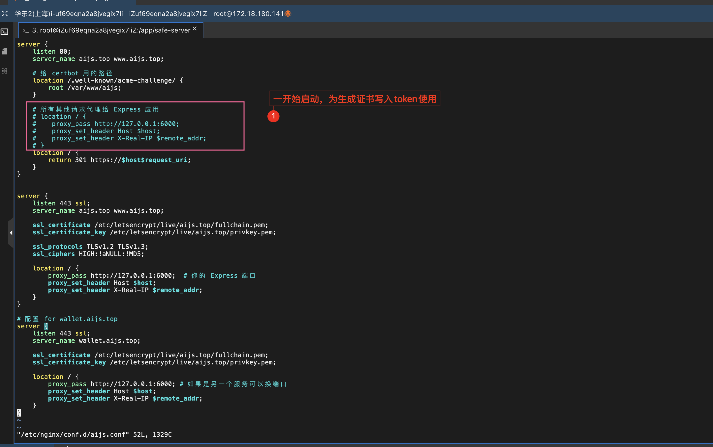
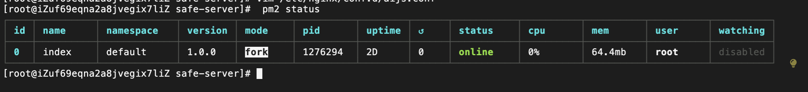
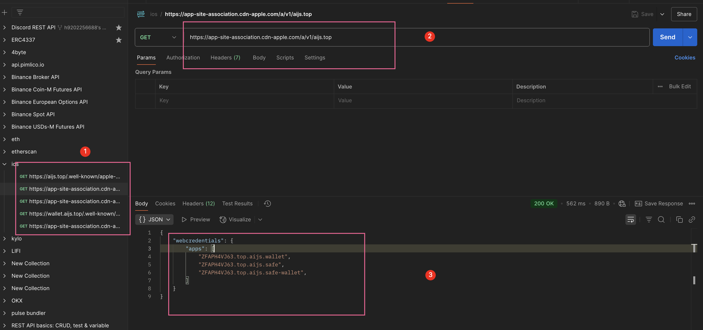

```sh
[root@iZuf69eqna2a8jvegix7liZ acme-challenge]# sudo certbot certonly --webroot -w /var/www/aijs -d aijs.top -d www.aijs.top
/var/www/aijs does not exist or is not a directory
Ask for help or search for solutions at https://community.letsencrypt.org. See the logfile /tmp/tmplvu5bls3/log or re-run Certbot with -v for more details.
[root@iZuf69eqna2a8jvegix7liZ acme-challenge]# sudo mkdir -p /var/www/aijs/.well-known/acme-challenge
[root@iZuf69eqna2a8jvegix7liZ acme-challenge]# sudo chown -R $USER:$USER /var/www/aijs
[root@iZuf69eqna2a8jvegix7liZ acme-challenge]# sudo nginx -t
nginx: the configuration file /etc/nginx/nginx.conf syntax is ok
nginx: configuration file /etc/nginx/nginx.conf test is successful
[root@iZuf69eqna2a8jvegix7liZ acme-challenge]# sudo systemctl reload nginx
[root@iZuf69eqna2a8jvegix7liZ acme-challenge]# sudo certbot certonly --webroot -w /var/www/aijs -d aijs.top -d www.aijs.top
Saving debug log to /var/log/letsencrypt/letsencrypt.log
Requesting a certificate for aijs.top and www.aijs.top

Successfully received certificate.
Certificate is saved at: /etc/letsencrypt/live/aijs.top/fullchain.pem
Key is saved at:         /etc/letsencrypt/live/aijs.top/privkey.pem
This certificate expires on 2025-09-18.
These files will be updated when the certificate renews.
Certbot has set up a scheduled task to automatically renew this certificate in the background.

- - - - - - - - - - - - - - - - - - - - - - - - - - - - - - - - - - - - - - - -
If you like Certbot, please consider supporting our work by:
 * Donating to ISRG / Let's Encrypt:   https://letsencrypt.org/donate
 * Donating to EFF:                    https://eff.org/donate-le
- - - - - - - - - - - - - - - - - - - - - - - - - - - - - - - - - - - - - - - -
[root@iZuf69eqna2a8jvegix7liZ acme-challenge]# 
```


错误提示 `/var/www/aijs does not exist or is not a directory` 说明你给 certbot 指定的路径不存在。

你需要先创建该目录，并确保 Nginx 配置也指向这个目录。

---

### 解决步骤：

1. 创建目录

```bash
sudo mkdir -p /var/www/aijs/.well-known/acme-challenge
```

2. 修改目录权限（让你的 Web 服务用户能访问）

```bash
sudo chown -R $USER:$USER /var/www/aijs
```

或者用 `www-data`（Nginx 默认用户）根据你的环境调整

3. 确认 Nginx 配置（示例）

```nginx
server {
    listen 80;
    server_name aijs.top www.aijs.top;

    location /.well-known/acme-challenge/ {
        root /var/www/aijs;
    }

    location / {
        proxy_pass http://127.0.0.1:3000;  # 你的 Express 端口
        proxy_set_header Host $host;
        proxy_set_header X-Real-IP $remote_addr;
    }
}
```

4. 重新加载 Nginx

```bash
sudo nginx -t
sudo systemctl reload nginx
```

5. 再次执行 certbot

```bash
sudo certbot certonly --webroot -w /var/www/aijs -d aijs.top -d www.aijs.top
```

---

这样 certbot 会往 `/var/www/aijs/.well-known/acme-challenge/` 写验证文件，Nginx 会正确访问，证书申请成功。

如果需要我帮你写完整 nginx 配置或检查其他问题，随时告诉我！


# nginx

```
[root@iZuf69eqna2a8jvegix7liZ acme-challenge]# vim /etc/nginx/conf.d/aijs.conf
[root@iZuf69eqna2a8jvegix7liZ acme-challenge]# sudo nginx -t
nginx: the configuration file /etc/nginx/nginx.conf syntax is ok
nginx: configuration file /etc/nginx/nginx.conf test is successful
[root@iZuf69eqna2a8jvegix7liZ acme-challenge]# sudo systemctl reload nginx
```
   


```
server {
    listen 80;
    server_name aijs.top www.aijs.top;

    # 给 certbot 用的路径
    location /.well-known/acme-challenge/ {
        root /var/www/aijs;
    }

    # 所有其他请求代理给 Express 应用
    # location / {
    #    proxy_pass http://127.0.0.1:6000;
    #    proxy_set_header Host $host;
    #    proxy_set_header X-Real-IP $remote_addr;
    # }
    location / {
        return 301 https://$host$request_uri;
    }
}


server {
    listen 443 ssl;
    server_name aijs.top www.aijs.top;

    ssl_certificate /etc/letsencrypt/live/aijs.top/fullchain.pem;
    ssl_certificate_key /etc/letsencrypt/live/aijs.top/privkey.pem;

    ssl_protocols TLSv1.2 TLSv1.3;
    ssl_ciphers HIGH:!aNULL:!MD5;

    location / {
        proxy_pass http://127.0.0.1:6000;  # 你的 Express 端口
        proxy_set_header Host $host;
        proxy_set_header X-Real-IP $remote_addr;
    }
}

# 配置 for wallet.aijs.top 这里由于bundle id 与域名强绑定，所以又加了一个域名
server {
    listen 443 ssl;
    server_name wallet.aijs.top;

    ssl_certificate /etc/letsencrypt/live/aijs.top/fullchain.pem;
    ssl_certificate_key /etc/letsencrypt/live/aijs.top/privkey.pem;

    location / {
        proxy_pass http://127.0.0.1:6000; # 如果是另一个服务可以换端口
        proxy_set_header Host $host;
        proxy_set_header X-Real-IP $remote_addr;
    }
}
```

# pm2

要让 Node.js 应用在后台运行，你可以使用以下方法：

### 使用 `nohup`

```bash
nohup node index.js > output.log 2>&1 &
```

- `output.log` 用于保存输出日志。
- `2>&1` 将错误输出重定向到同一个日志文件。

### 使用 `pm2`

`pm2` 是一个强大的进程管理工具，适合在生产环境中使用。

1. 安装 `pm2`：

   ```bash
   npm install -g pm2
   ```

2. 启动应用：

   ```bash
   pm2 start index.js
   ```

3. 查看运行状态：

   ```bash
   pm2 status
   ```

4. 停止应用：

   ```bash
   pm2 stop index.js
   ```

5. 重启应用：

   ```bash
   pm2 restart index.js
   ```

6. 保存进程列表以便重启后自动启动：

   ```bash
   pm2 save
   ```

7. 设置开机自启动：

   ```bash
   pm2 startup
   ```

### 使用 `forever`

`forever` 也是一个简单的进程管理工具。

1. 安装 `forever`：

   ```bash
   npm install -g forever
   ```

2. 启动应用：

   ```bash
   forever start index.js
   ```

3. 查看运行中的应用：

   ```bash
   forever list
   ```

4. 停止应用：

   ```bash
   forever stop index.js
   ```

这些工具都能帮助你在后台运行 Node.js 应用并进行管理。

# apple-app-site-association 刷新

明白了，你访问的是 Apple 的 CDN 地址（`https://app-site-association.cdn-apple.com`），这个域名是 Apple 用来托管 **App Site Association（ASA）文件** 的公共 CDN 服务，用于 Apple 的 Universal Links、Sign in with Apple、WebAuthn、Passkeys 等功能。

例如你访问的这个地址：

```
https://app-site-association.cdn-apple.com/a/v1/wallet.aijs.top
```

是 Apple 自动从你的网站 `https://wallet.aijs.top/.well-known/apple-app-site-association` 拉取并缓存的副本。

---

## 🔍 为什么带参数的 URL 有响应，而不带参数的返回 Not Found？

这是 Apple CDN 的一个 **已知行为**：

- Apple CDN 会缓存你网站的 `apple-app-site-association` 文件。
- 但它对 **无参数请求** 可能会返回 `404 Not Found`，尤其是在缓存未命中或文件未成功拉取时。
- 而带有查询参数的请求（比如 `?foo`）可能会绕过某些 CDN 缓存策略，从而返回旧的或不同的内容。

---

## ✅ 如何让 Apple 更新缓存？

你无法直接控制 `app-site-association.cdn-apple.com`，但可以通过以下方式**触发 Apple 更新缓存**：

### 1. **确保你的服务器正确托管了 `.well-known/apple-app-site-association` 文件**

- 路径：`https://wallet.aijs.top/.well-known/apple-app-site-association`
- 要求：
  - 必须是 HTTPS
  - 不允许重定向
  - 响应头必须设置正确的 `Content-Type`：
    ```
    Content-Type: application/json
    ```

### 2. **使用 Apple 的验证工具触发刷新**

访问 Apple 的验证工具（适用于 Sign in with Apple 和 Universal Links）：

- [https://developer.apple.com/account/resources/identifiers/list/serviceId](https://developer.apple.com/account/resources/identifiers/list/serviceId)

在你的服务 ID 或 App ID 中，重新配置 Web credentials 或 Associated Domains，然后保存，这通常会触发 Apple 重新拉取你的 ASA 文件。

### 3. **等待自动刷新**

https://developer.apple.com/documentation/bundleresources/entitlements/com.apple.developer.associated-domains

Apple 会周期性地刷新缓存（通常是 24 小时内），但这不保证立即生效。

---

## 🧪 你可以做的测试

1. **检查你自己的服务器是否正确返回 ASA 文件**

```bash
curl -i https://wallet.aijs.top/.well-known/apple-app-site-association
```

确认：
- 状态码是 200
- 没有重定向
- `Content-Type` 是 `application/json`
- 返回内容是合法 JSON

2. **修改内容后重新部署**

如果你更新了 ASA 文件，确保部署成功后，再去 Apple 后台触发更新，或等待 CDN 缓存刷新。

---

## 🚫 注意

你不能直接控制或清除 `https://app-site-association.cdn-apple.com` 的缓存，因为它是 Apple 的服务。但你可以通过确保源站配置正确 + 在 Apple 后台触发刷新，间接影响它的缓存更新。

---

📌 总结：

| 操作                | 是否可以做                              |
| ------------------- | --------------------------------------- |
| 修改 CDN 内容       | ❌ 不可控（Apple 管理）                  |
| 修改源站 ASA 文件   | ✅ 可控                                  |
| 触发 Apple 重新拉取 | ✅ 可控（通过 Apple 后台或配置）         |
| 立即刷新 CDN 缓存   | ❌ 无法强制立即生效，但 Apple 会定期刷新 |

如果你需要我帮你检查你的源站配置是否正确，也可以贴上 ASA 文件内容或源站 URL。


# 测试



# 记录

<video controls src="react-native-passkey.mp4" title="Title"></video>