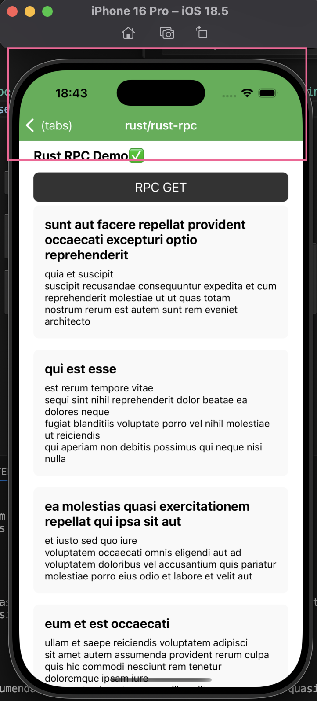

## 配置



```tsx
  const navigation = useNavigation();


  useEffect(() => {
    navigation.setOptions({
      headerStyle: {
        backgroundColor: '#4CAF50', // 设置背景色
      },
      headerTintColor: '#fff', // 设置文本颜色
    });
  }, [navigation]);


```

