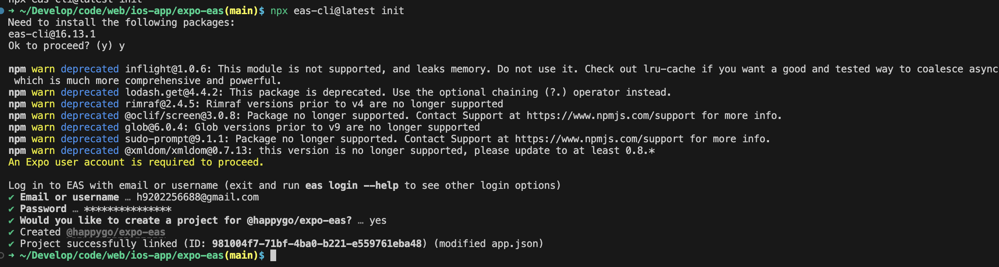
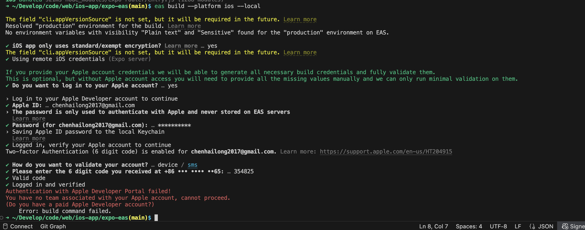

## local build

```
eas build --platform ios --local
```



## name: Create development builds 本地有ios 相关expo module 需不需要额外配置什么

如果你在本地使用 EAS Build 构建 iOS 应用，并且你的项目中使用了 **iOS 相关的 Expo 模块（如 `expo-camera`、`expo-location`、`expo-media-library` 等）**，那么你需要确保以下几点配置正确，以确保本地构建成功。

---

### ✅ 必要配置与检查项

#### 1. **确保项目是 EAS 模式（预构建）**
你必须使用 **预构建（prebuild）流程**，即项目中包含原生代码（`ios/` 和 `android/` 文件夹）。

如果你还没有预构建，可以运行：

```bash
npx expo prebuild
```

这会根据你的 `app.json` / `app.config.js` 自动生成 `ios/` 和 `android/` 文件夹，并安装所需的原生依赖。

---

#### 2. **安装所有 iOS 原生模块依赖**

如果你使用了需要原生模块的 Expo 模块（比如 `expo-camera`），你需要：

- 确保模块已安装：

  ```bash
  npx expo install expo-camera
  ```

- 然后在 `ios/` 目录中安装 CocoaPods 依赖：

  ```bash
  cd ios
  pod install
  cd ..
  ```

---

#### 3. **配置 `eas.json`**

确保你的 `eas.json` 文件中配置了适合本地构建的 profile，例如：

```json
{
  "build": {
    "development": {
      "developmentClient": true,
      "distribution": "internal",
      "ios": {
        "simulator": true
      }
    }
  }
}
```

> ⚠️ `developmentClient: true` 表示你要构建一个 **开发客户端（Development Build）**，用于本地调试。

---

#### 4. **运行本地构建**

```bash
eas build --platform ios --profile development --local
```

---

#### 5. **运行到模拟器**

构建成功后，会生成一个 `.app` 文件，你可以：

- 拖入 iOS 模拟器运行
- 或使用 `xcrun simctl install` 命令手动安装：

```bash
xcrun simctl install booted path/to/your.app
xcrun simctl launch booted your.bundle.identifier
```

---

### ✅ 常见问题排查

| 问题               | 解决方案                                               |
| ------------------ | ------------------------------------------------------ |
| CocoaPods 报错     | 确保你安装了 `cocoapods`：`sudo gem install cocoapods` |
| 模块缺失           | 运行 `npx expo install` 安装所有模块                   |
| `ios/` 目录不存在  | 运行 `npx expo prebuild`                               |
| 构建失败找不到模块 | 删除 `ios/Pods` 和 `Podfile.lock`，重新 `pod install`  |
| Xcode 版本问题     | 确保 macOS 上的 Xcode 是最新版本                       |

---

### ✅ 推荐开发流程

1. 使用 `expo install` 安装模块
2. 使用 `npx expo prebuild` 生成原生代码
3. 在 `ios/` 中运行 `pod install`
4. 使用 `eas build --local` 构建开发客户端
5. 在模拟器或真机上运行调试

---

如果你提供具体使用了哪些模块，我可以帮你检查是否需要额外的原生配置（如权限、`Info.plist` 修改等）。需要我帮你检查吗？

## 如果想要在真机上测试呢

如果你想在 **真机（iPhone）上测试本地构建的 Expo iOS 应用**，你需要做一些额外的配置，因为真机部署涉及到 Apple 的签名机制（证书、描述文件等）。下面是完整的流程：

---

### ✅ 真机测试本地构建（iOS）的完整步骤

#### 1. **准备条件**

| 项目                 | 说明                                          |
| -------------------- | --------------------------------------------- |
| macOS                | 必须在 macOS 上操作                           |
| Xcode                | 安装最新版本                                  |
| Apple Developer 账号 | 需要一个付费的 Apple 开发者账号（99 美元/年） |
| 真机连接             | 用 USB 或 Wi-Fi 连接你的 iPhone               |

---

#### 2. **配置 Apple 签名（证书 & 描述文件）**

你有两种方式来配置签名：

##### ✅ 自动配置（推荐）

EAS CLI 支持自动管理签名证书和描述文件。

```bash
eas credentials
```

按照提示操作，EAS 会帮你生成或上传：

- Distribution Certificate（分发证书）
- Provisioning Profile（描述文件）

> ⚠️ 本地构建时也可以使用这些证书。

---

#### 3. **配置 `eas.json`**

在 `eas.json` 中添加一个适用于真机的构建 profile，例如：

```json
{
  "build": {
    "development": {
      "developmentClient": true,
      "distribution": "internal",
      "ios": {
        "simulator": false
      }
    }
  }
}
```

- `developmentClient: true`：构建一个开发客户端（用于加载 `expo-dev-client`）
- `simulator: false`：表示构建用于真机

---

#### 4. **构建 iOS 开发客户端（用于真机）**

运行：

```bash
eas build --platform ios --profile development --local
```

构建完成后，会生成一个 `.ipa` 文件（用于真机安装）。

---

#### 5. **将 `.ipa` 安装到真机**

有几种方式可以安装：

##### ✅ 方法 A：使用 `Apple Configurator`（推荐）

1. 打开 Apple Configurator（App Store 可下载）
2. 将 iPhone 连到电脑
3. 拖拽 `.ipa` 文件到 Apple Configurator 窗口中，即可安装

##### ✅ 方法 B：使用 `ios-deploy`（命令行）

安装工具：

```bash
brew install ios-deploy
```

然后运行：

```bash
ios-deploy --bundle path/to/your.app
```

（注意：`.ipa` 需要先解压为 `.app`）

---

#### 6. **在真机上运行开发客户端**

1. 打开你安装的 App（开发客户端）
2. 它会显示一个界面，等待你输入项目的开发服务器地址
3. 使用 `expo start --dev-client` 启动项目
4. 在浏览器中扫描 QR 码，或手动输入地址到真机 App 中

---

### ✅ 小提示

| 项目     | 说明                                                                                                                                     |
| -------- | ---------------------------------------------------------------------------------------------------------------------------------------- |
| 真机调试 | 可以使用 Safari 的 “开发者” 工具进行调试（需开启 Web Inspector）                                                                         |
| 权限配置 | 使用如 `expo-camera`、`expo-location` 等模块时，别忘了在 `app.json` 中配置 iOS 权限（`infoPlist`）                                       |
| 示例：   | ```json "ios": { "infoPlist": { "NSCameraUsageDescription": "需要使用相机", "NSLocationWhenInUseUsageDescription": "需要访问位置" } }``` |

---

### ✅ 总结流程图

```text
expo install 模块
↓
npx expo prebuild
↓
cd ios && pod install
↓
配置 eas.json（simulator: false）
↓
eas credentials （配置 Apple 签名）
↓
eas build --platform ios --profile development --local
↓
生成 .ipa 文件
↓
使用 Apple Configurator 安装到真机
↓
expo start --dev-client
↓
在真机中打开 App，连接开发服务器
```

---

如果你愿意提供你使用的模块列表，我还可以帮你生成对应的 `infoPlist` 权限配置。需要吗？