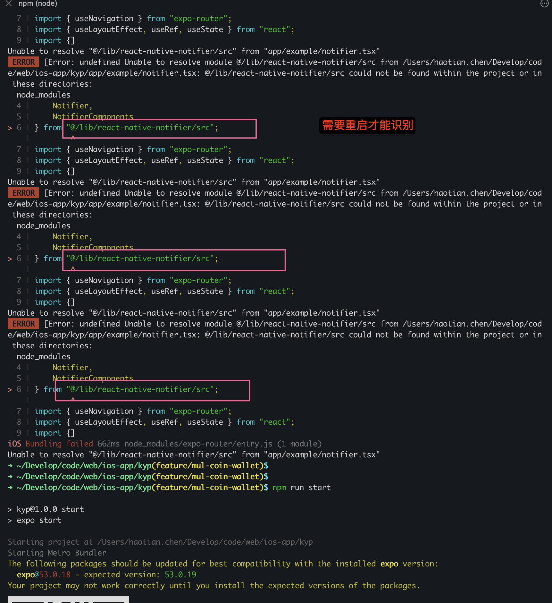

## modal 遮挡住toast 的问题

试了很多库都解决不了，发现 react-native-notifier 最新版本可以处理

<video controls src="Simulator Screen Recording - iPhone 16 Pro - 2025-07-15 at 10.59.19.mp4" title="Title"></video>


```tsx
import BackButton from "@/components/BackButton";
import { useToast } from "@/components/ToastContext";
import {
  Notifier,
  NotifierComponents
} from "@/lib/react-native-notifier/src";
import { useNavigation } from "expo-router";
import { useLayoutEffect, useState } from "react";
import {
  Button,
  Dimensions,
  Modal,
  SafeAreaView,
  StyleSheet,
  Text,
  View,
} from "react-native";
const { height } = Dimensions.get("window");

const AndroidToast = ({ title, description }) => {
  return (
    <View style={AndroidToastStyles.container}>
      <View style={AndroidToastStyles.content}>
        <Text style={AndroidToastStyles.description}>{description}</Text>
      </View>
    </View>
  );
};

const AndroidToastStyles = StyleSheet.create({
  container: {
    // padding: 10,
    // borderRadius: 5,
    alignItems: "center",
    justifyContent: "center",
    // position: 'absolute',
    // bottom: 100, // 距离底部 100
    // left: 20,
    // right: 20,
    top: height / 2,
  },
  content: {
    backgroundColor: "#00000066",
    padding: 10,
    borderRadius: 25,
    alignItems: "center",
    justifyContent: "center",
    width: "60%",
  },
  title: {
    color: "white",
    fontWeight: "bold",
    fontSize: 16,
  },
  description: {
    color: "white",
    fontSize: 14,
  },
});

const styles = StyleSheet.create({
  safeArea: {
    backgroundColor: "orange",
  },
  container: {
    padding: 20,
  },
  title: { color: "white", fontWeight: "bold" },
  description: { color: "white" },
});

const CustomComponent = ({ title, description }) => (
  <SafeAreaView style={styles.safeArea}>
    <View style={styles.container}>
      <Text style={styles.title}>{title}</Text>
      <Text style={styles.description}>{description}</Text>
    </View>
  </SafeAreaView>
);
const ToastExample = () => {
  const [visible, setVisible] = useState(false);
  const navigation = useNavigation();
  useLayoutEffect(() => {
    navigation.setOptions({
      title: "Root Toast Example",
      headerLeft: () => <BackButton />,
    });
  }, [navigation]);
  const { showToast } = useToast();

  const renderContent = () => {
    return (
      <View>
        <Button
          title="Show Custom Component"
          onPress={() => {
            Notifier.showNotification({
              title: "Custom",
              description: "Example of custom component",
              Component: CustomComponent,
              duration: 3000,
            });
          }}
        />
        <Button
          title="Show Android Toast"
          onPress={() => {
            Notifier.showNotification({
              title: "Custom",
              description: "Example of custom component",
              Component: AndroidToast,
              duration: 3000,
              useRNScreensOverlay: true,
              animationDuration: 0,
              showAnimationDuration: 0,
              hideAnimationDuration:0
            });
          }}
        />
        <Button
          title="Show Notification Alert Success"
          onPress={() =>
            Notifier.showNotification({
              title: "Toast Title",
              description: "This is a custom toast message.",
              Component: NotifierComponents.Alert,
              componentProps: {
                type: "success", // 可选: success, error, warning, info
              },
              duration: 3000, // 持续时间
            })
          }
        />
        <Button
          title="Show Notification Alert Error"
          onPress={() =>
            Notifier.showNotification({
              title: "Toast Title",
              description: "This is a custom toast message.",
              Component: NotifierComponents.Alert,
              componentProps: {
                type: "error", // 可选: success, error, warning, info
              },
              duration: 3000, // 持续时间
            })
          }
        />
        <Button
          title="Show Notification"
          onPress={() =>
            Notifier.showNotification({
              title: "Toast Title",
              description: "This is a custom toast message.",
              Component: NotifierComponents.Notification,
              componentProps: {
                duration: 2000,
              },
            })
          }
        />
        <Button
          title="Show Toast"
          onPress={() => {
            showToast("This is a custom toast message.");
          }}
        />
      </View>
    );
  };
  return (
    <SafeAreaView style={{ flex: 1 }}>
      <Button title="Show" onPress={() => setVisible(true)} />
      {renderContent()}
      <Modal
        visible={visible}
        presentationStyle="formSheet"
        onRequestClose={() => setVisible(false)}
      >
        <View
          style={{
            flex: 1,
            justifyContent: "center",
            alignItems: "center",
            backgroundColor: "red",
            paddingTop: 120,
          }}
        >
          <Button title="Close" onPress={() => setVisible(false)} />
          {renderContent()}
        </View>
      </Modal>
    </SafeAreaView>
  );
};

export default ToastExample;

```

## react-native-notifier 新版本没有发布，直接使用源码
## 将react-native-notifier放到项目中

