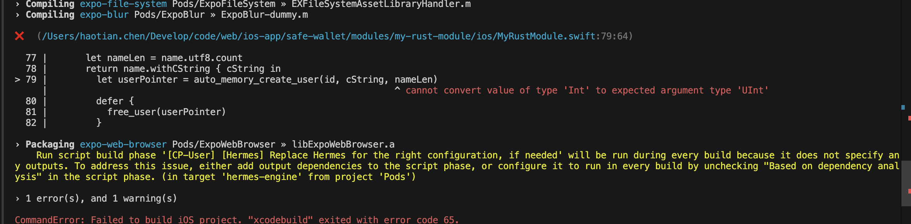
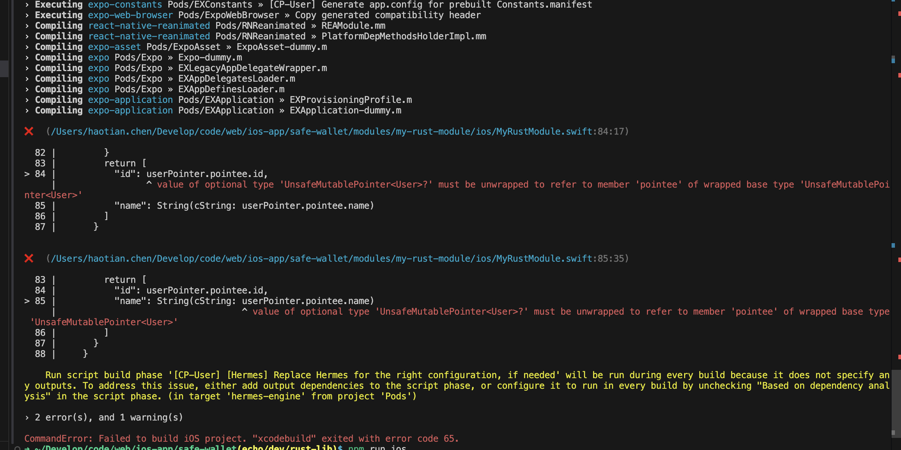

## swift -> rust 传递/接收对象
### 手动管理

```rs
// 确保结构体的内存布局与 C 语言兼容
#[repr(C)]
pub struct User {
    id: i32,
    name: *const c_char,
    name_len: usize,
}
```


```rs

// #[unsafe(no_mangle)]
// pub extern "C" fn create_user(id: i32, name: *const u8, name_len: usize) -> User {
//     let c_name = unsafe { std::slice::from_raw_parts(name, name_len) };
//     let c_string = CString::new(c_name).expect("CString::new failed");
//     let name_ptr = c_string.as_ptr();

//     User { id, name: name_ptr, name_len } // ❗️悬空指针， 被rust释放掉
// }

#[unsafe(no_mangle)]
pub extern "C" fn create_user(id: i32, name: *const u8, name_len: usize) -> User {
    let c_name = unsafe { std::slice::from_raw_parts(name, name_len) };
    let c_string = CString::new(c_name).expect("CString::new failed");
    let name_ptr = c_string.into_raw(); // ❗️内存泄漏, 所有权转移到rust 之外

    User { id, name: name_ptr, name_len }
}

#[unsafe(no_mangle)]
pub extern "C" fn free_user(user: Box<User>) {
    if !user.name.is_null() {
        unsafe {
            drop(CString::from_raw(user.name as *mut c_char));
        }
    }
    // Box will automatically handle the deallocation of `user` itself
}

```

### 自动管理


```rs
#[unsafe(no_mangle)]
pub extern "C" fn auto_memory_create_user(id: i32, name: *const u8, name_len: usize) -> Box<User> {
    let c_name = unsafe { std::slice::from_raw_parts(name, name_len) };
    let c_string = CString::new(c_name).expect("CString::new failed");
    let name_ptr = c_string.as_ptr();
    std::mem::forget(c_string); // Prevent Rust from automatically freeing the CString

    Box::new(User { id, name: name_ptr, name_len })
}

```
## usize -> swift Uint




```
❌  (/Users/haotian.chen/Develop/code/web/ios-app/safe-wallet/modules/my-rust-module/ios/MyRustModule.swift:79:64)

  77 |       let nameLen = name.utf8.count
  78 |       return name.withCString { cString in
> 79 |         let userPointer = auto_memory_create_user(id, cString, nameLen)
     |                                                                ^ cannot convert value of type 'Int' to expected argument type 'UInt'
  80 |         defer {
  81 |           free_user(userPointer)
  82 |         }

› Packaging expo-web-browser Pods/ExpoWebBrowser » libExpoWebBrowser.a
    Run script build phase '[CP-User] [Hermes] Replace Hermes for the right configuration, if needed' will be run during every build because it does not specify any outputs. To address this issue, either add output dependencies to the script phase, or configure it to run in every build by unchecking "Based on dependency analysis" in the script phase. (in target 'hermes-engine' from project 'Pods')

› 1 error(s), and 1 warning(s)

CommandError: Failed to build iOS project. "xcodebuild" exited with error code 65.
```

## optional type



```
❌  (/Users/haotian.chen/Develop/code/web/ios-app/safe-wallet/modules/my-rust-module/ios/MyRustModule.swift:84:17)

  82 |         }
  83 |         return [
> 84 |           "id": userPointer.pointee.id,
     |                 ^ value of optional type 'UnsafeMutablePointer<User>?' must be unwrapped to refer to member 'pointee' of wrapped base type 'UnsafeMutablePointer<User>'
  85 |           "name": String(cString: userPointer.pointee.name)
  86 |         ]
  87 |       }

```


这个错误提示你需要解包可选类型 `UnsafeMutablePointer<User>?`。你可以使用 `guard let` 或 `if let` 来安全地解包它。以下是如何处理的示例：

```swift
Function("createUser") { (id: Int32, name: String) -> [String: Any] in
    let nameLen = name.utf8.count

    guard nameLen >= 0 else {
        // 处理错误情况，例如抛出异常或返回错误
        return [:] // 或者其他适当的错误处理
    }
    
    return name.withCString { cString in
        // 假设 create_user 返回一个 Optional 类型的指针
        let userPointer = create_user(id, cString, UInt(nameLen))
        
        // 安全解包 userPointer
        guard let userPointer = userPointer else {
            // 处理指针为 nil 的情况
            return [:] // 或者其他适当的错误处理
        }
        
        return [
            "id": userPointer.pointee.id,
            "name": String(cString: userPointer.pointee.name)
        ]
    }
}
```

### 说明

- **解包指针**: 使用 `guard let` 来安全地解包 `userPointer`，确保它不是 `nil`。
- **错误处理**: 如果 `userPointer` 为 `nil`，可以选择返回错误或进行其他处理。