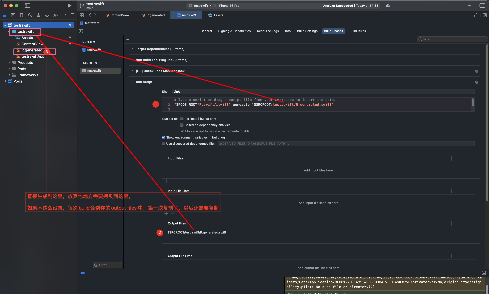
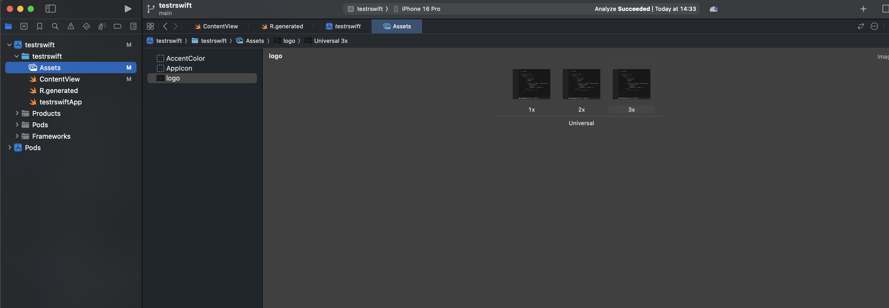
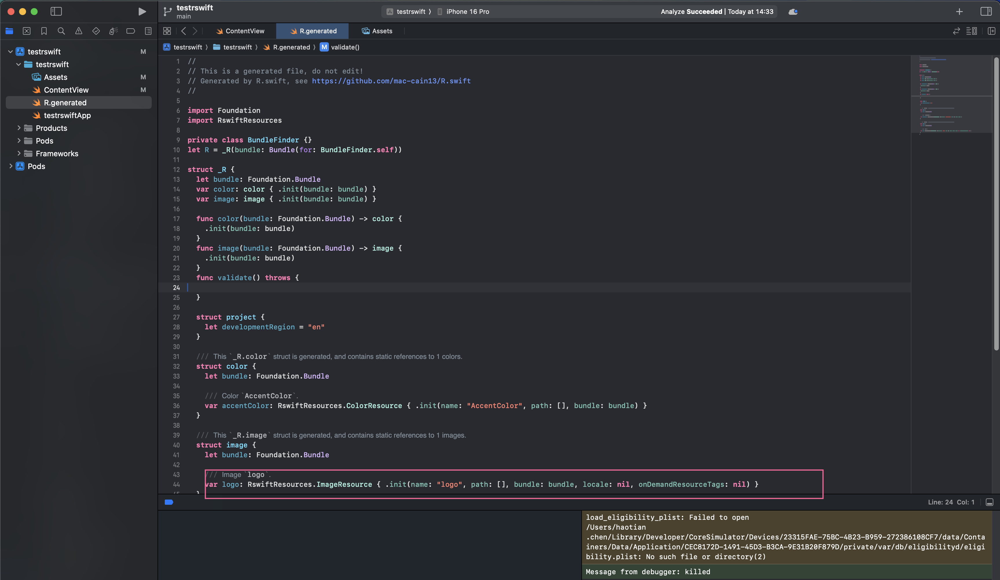

## N遍没解决，各种乱七八糟的问题

## cocoapods 集成 


1. Add `pod 'R.swift'` to your [Podfile](http://cocoapods.org/#get_started) and run `pod install`
2. In Xcode: Click on your project in the file list, choose your target under `TARGETS`, click the `Build Phases` tab and add a `New Run Script Phase` by clicking the little plus icon in the top left
3. Drag the new `Run Script` phase **above** the `Compile Sources` phase and **below** `Check Pods Manifest.lock`, expand it and paste the following script:
```bash
   "$PODS_ROOT/R.swift/rswift" generate "$SRCROOT/你的应用名字/R.generated.swift"

   # 直接生成到这里,放其他地方需要拷贝到这里,
   # 如果不这么设置,每次build会到你的output files中,第一次制了,以后还需要复制
```
4. Add `$SRCROOT/R.generated.swift` to the "Output Files" of the Build Phase
5. Uncheck "Based on dependency analysis" so that R.swift is run on each build
6. ✅ https://github.com/mac-cain13/R.swift/issues/855
7. Build your project, in Finder you will now see a `R.generated.swift` in the `$SRCROOT`-folder, drag the `R.generated.swift` files into your project and **uncheck** `Copy items if needed`
8. 每次改完内容build需要手动加入到xcode

_Screenshot of the Build Phase can be found [here](Documentation/Images/BuildPhaseExample.png)_

_Tip:_ Add the `*.generated.swift` pattern to your `.gitignore` file to prevent unnecessary conflicts.


## 截图



### logo


### logo2


<video controls src="录屏2025-07-01 14.41.13.mov" title="Title"></video>


## example github

https://github.com/hpgo6688/testrswift