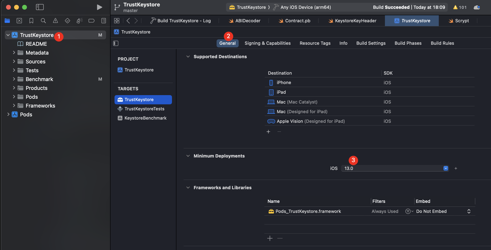
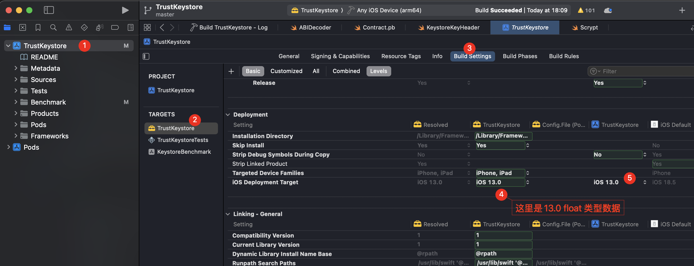
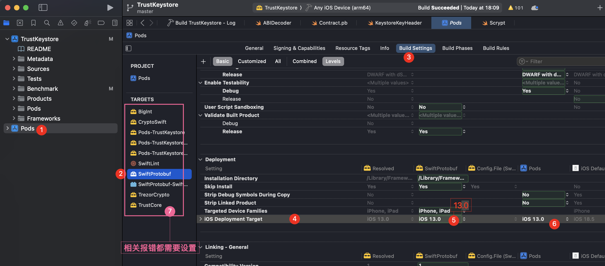
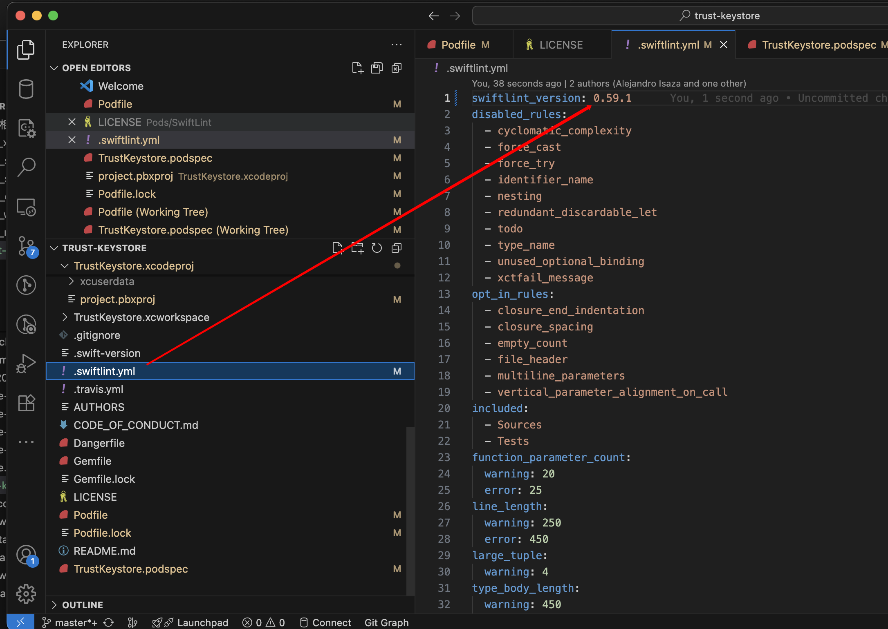
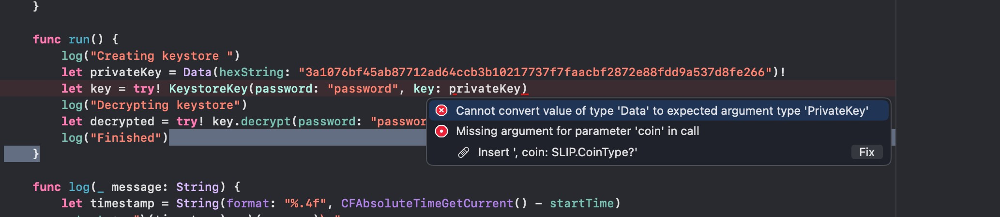
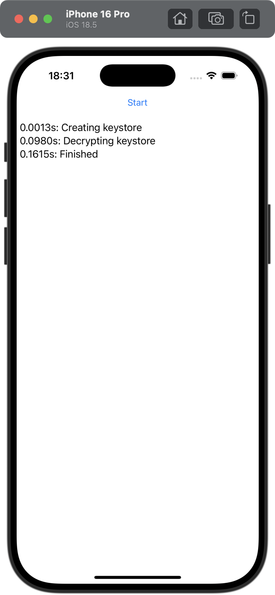

## libarclite
```vb
SDK does not contain 'libarclite' at the path '/Applications/Xcode.app/Contents/Developer/Toolchains/XcodeDefault.xctoolchain/usr/lib/arc/libarclite_iphonesimulator.a'; try increasing the minimum deployment target
```





## pod相关库
```vb
Compiling for iOS 10.0, but module 'SwiftProtobuf' has a minimum deployment target of iOS 11.0

```



## SwiftLint 报错
```vb
warning: Currently running SwiftLint 0.59.1 but configuration specified version 0.23.0.
Command PhaseScriptExecution failed with a nonzero exit code
```




## 代码报错




```swift

// Copyright © 2017 Trust.
//
// This file is part of Trust. The full Trust copyright notice, including
// terms governing use, modification, and redistribution, is contained in the
// file LICENSE at the root of the source code distribution tree.

import TrustKeystore
import UIKit
import TrustCore

class ViewController: UIViewController {
    @IBOutlet private weak var startStopButton: UIButton!
    @IBOutlet private weak var outputTextView: UITextView!

    var running = false
    var startTime: TimeInterval = 0
    var output = ""

    @IBAction func start() {
        if running {
            return
        }

        running = true
        startStopButton.isEnabled = false
        startTime = CFAbsoluteTimeGetCurrent()
        DispatchQueue.global(qos: .userInitiated).async {
            self.run()
            DispatchQueue.main.async {
                self.stop()
            }
        }
    }

    func stop() {
        running = false
        startStopButton.isEnabled = true
    }

    func run() {
        log("Creating keystore")
            
            // Initialize PrivateKey from Data
            let privateKeyData = Data(hexString: "3a1076bf45ab87712ad64ccb3b10217737f7faacbf2872e88fdd9a537d8fe266")
            
            guard let unwrappedPrivateKeyData = privateKeyData else {
                log("Failed to convert hex string to Data")
                return
            }
            
            guard let privateKey = PrivateKey(data: unwrappedPrivateKeyData) else {
                log("Failed to create PrivateKey")
                return
            }
            
            // Specify the coin type
            let coinType: SLIP.CoinType = .bitcoin // Replace with the appropriate coin type
            
            // Initialize KeystoreKey with the coin type
            do {
                let key = try KeystoreKey(password: "password", key: privateKey, coin: coinType)
                log("Decrypting keystore")
                let decrypted = try key.decrypt(password: "password")
                log("Finished")
            } catch {
                log("Error: \(error)")
            }
    }

    func log(_ message: String) {
        let timestamp = String(format: "%.4f", CFAbsoluteTimeGetCurrent() - startTime)
        output += "\(timestamp)s: \(message)\n"
        DispatchQueue.main.async {
            self.outputTextView.text = self.output
        }
    }
}


```


