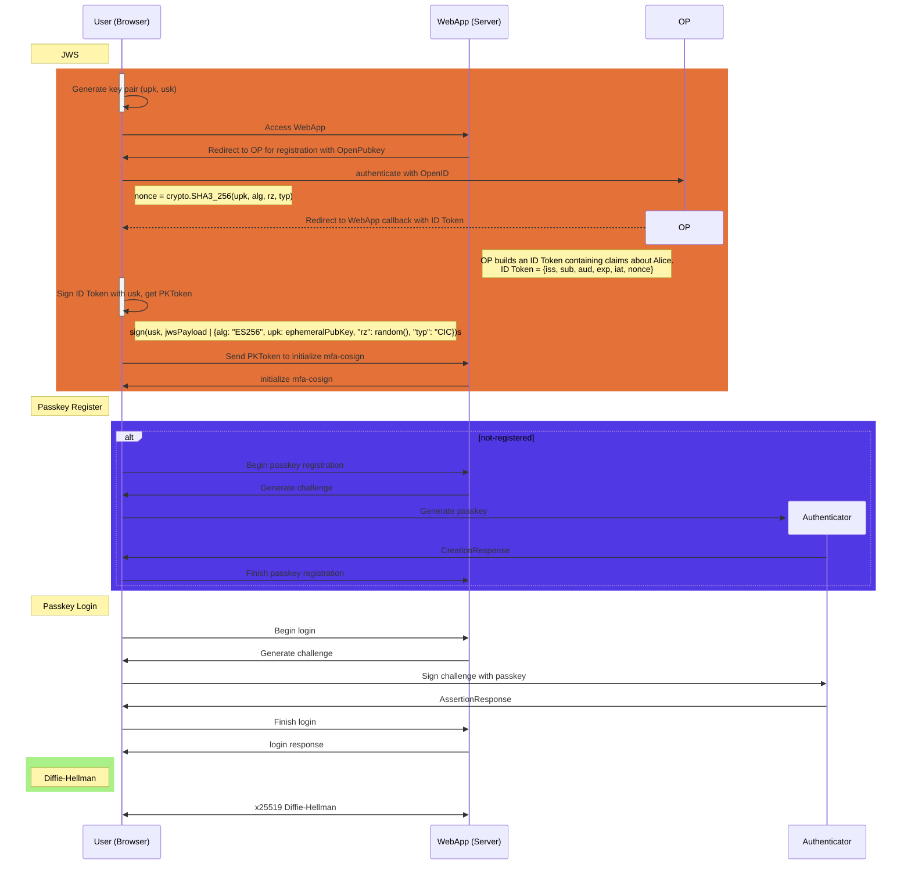

OpenPubkey Authentication
========================

[OpenPubkey](https://github.com/openpubkey/openpubkey) is a protocol for leveraging OpenID Providers (OPs) to bind identities to public keys. It adds user- or workload-generated public keys to OpenID Connect (OIDC), enabling identities to sign messages or artifacts under their OIDC identity.

This document describes how to use OpenPubkey with passkey as mfa for authentication in a web application. It covers the following topics:

* OpenPubKey Registration with Passkey
* OpenPubkey Authentication with Passkey

Passkey is a new authentication standard that allows users to log in to applications using a public key instead of a password. It is designed to be more secure and user-friendly than traditional password-based authentication methods. Passkeys are based on the WebAuthn standard, which is supported by most modern web browsers and devices. They allow users to authenticate using biometric methods (such as fingerprint or facial recognition) or a PIN, making them more secure than passwords.

## OpenPubkey Registration and Authentication with Passkey



## Public Key Token (PKToken)

The Public Key Token (PKToken) is a JSON Web Token (JWT) that contains the public key and other information about the user. It is used to authenticate the user and verify their identity. The PKToken is signed by the user's private key, which is stored securely on the user's device.
The PKToken contains the following claims:

* `iss`: The issuer of the token (the OpenID Provider).
* `sub`: The subject of the token (the user).
* `aud`: The audience of the token (the web application).
* `exp`: The expiration time of the token.
* `iat`: The issued at time of the token.
* `nonce`: A unique identifier for the token.

The Protected Header of the PKToken contains the following fields:

* `upk`: The user's public key.
* `alg`: The algorithm used to sign the token.
* `rz`: A random value used to prevent replay attacks.
* `typ`: The type of the token (CIC).

```json
{
    "payload": {
        "iss": "https://accounts.google.com",
        "aud": "878305696756-6maur39hl2psmk23imilg8af815ih9oi.apps.googleusercontent.com",
        "sub": "123456789010",
        "email": "alice@acme.co",
        "nonce": <crypto.SHA3_256(upk=alice-pubkey, alg=ES256, rz=crypto.Rand(), typ="CIC")>,
        "name": "Alice Example",
        ...
    }
    "signatures": [
        {"protected": {"alg": "RS256", "kid": "1234...", "typ": "JWT"},
        "signature": <SIGN(google-signkey, (payload, signatures[0].protected))>
        },
        {"protected": {"upk": alice-pubkey, "alg": "EC256", "rz": crypto.Rand(), "typ": "CIC"},
        "signature": <SIGN(alice-signkey, (payload, signatures[1].protected))>
        },
    ]
}
```

## How does OpenPubkey handle OP (OpenID Provider) public key rollover?

OPs (OpenID Providers) issue ID Tokens by signing them. As required by OpenID Connect, OPs make their public keys avalaible at a JWKS (JSON Web Key Set) URI. Anyone can download the OP's public keys from the JWKS URI and verify an OP's signatures on an ID Token. The location of the JWKS URI is defined in the OPs "/.well-known/openid-configuration". OPs rotate the public and signing keys they use for ID Tokens.

| OpenID Provider | .well-known/openid-configuration | JWKS URI |  ~key rotation |
| -------------| ------------- | ------------- | ------------- |
| Google | https://accounts.google.com/.well-known/openid-configuration  | https://www.googleapis.com/oauth2/v3/certs |~14 days  |
| GitHub Actions | https://token.actions.githubusercontent.com/.well-known/openid-configuration | https://token.actions.githubusercontent.com/.well-known/jwks  |~84 days |
| Gitlab | https://gitlab.com/.well-known/openid-configuration | https://gitlab.com/oauth/discovery/keys  |? days |
| Microsoft | https://login.microsoftonline.com/common/.well-known/openid-configuration | https://login.microsoftonline.com/common/discovery/v2.0/keys  |? days |

OpenPubkey relies on verifiers being able to check the OP's signature on the ID Token's contained in the PK Token. For many use cases, such as authenticating access to a server, a user can request a new ID Token after the OP rotates their keys. Such use cases do not require that PK Tokens remain verifiable beyond an OP key rotation.
