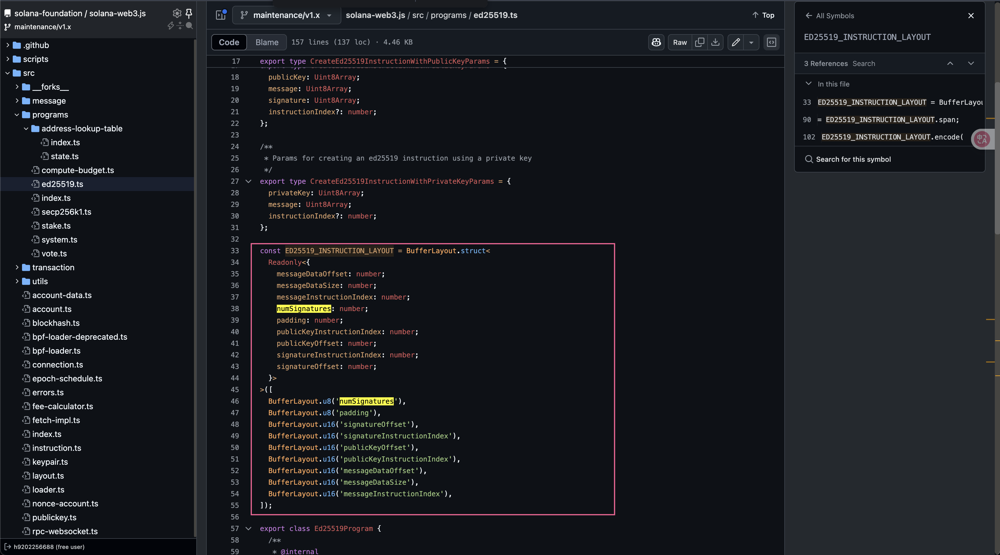
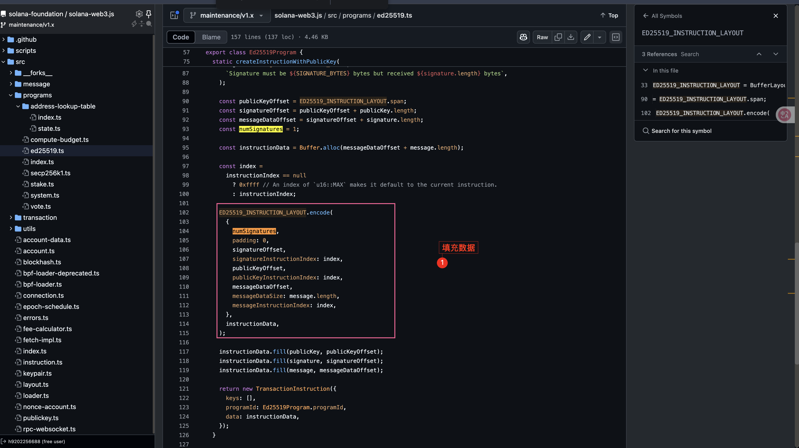
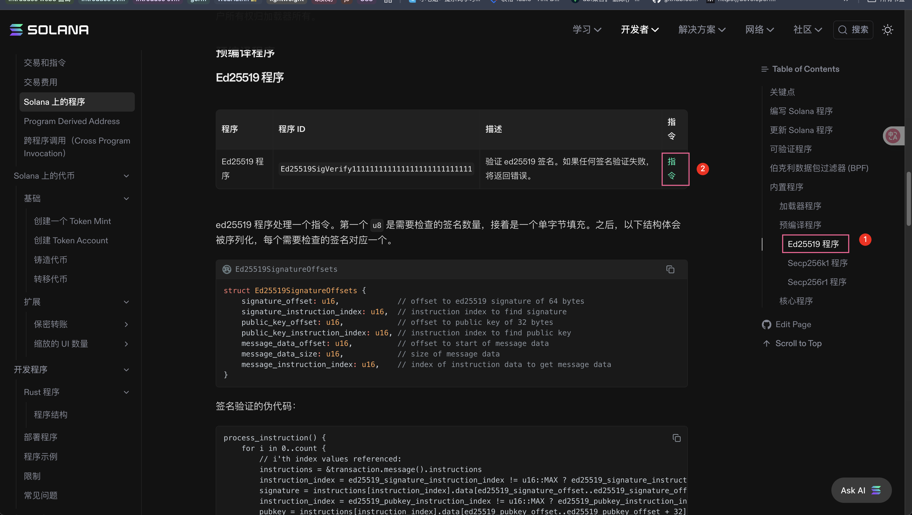
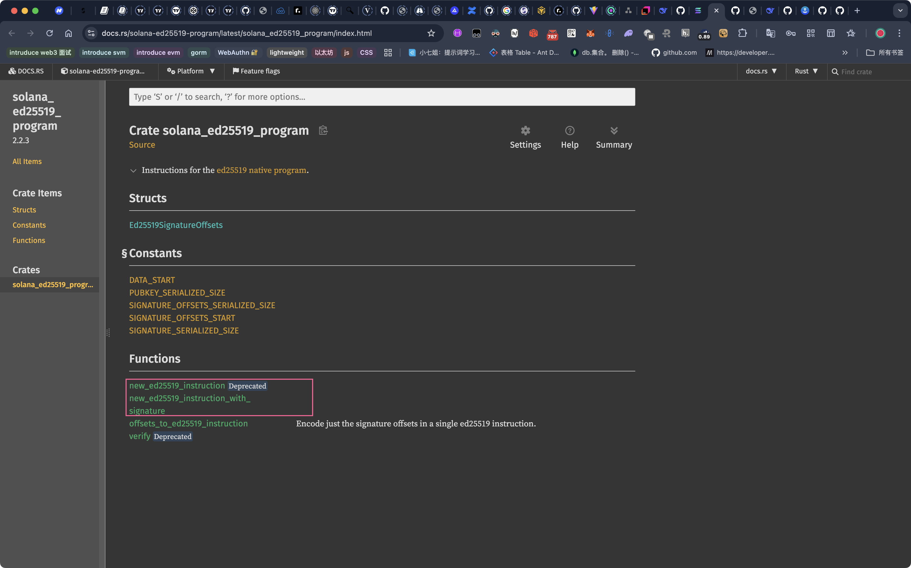
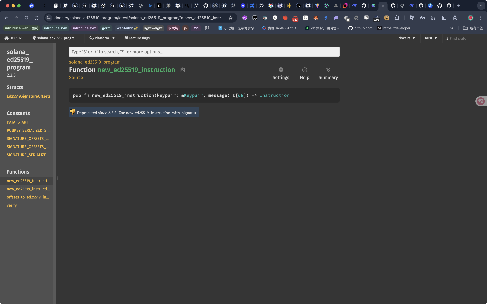
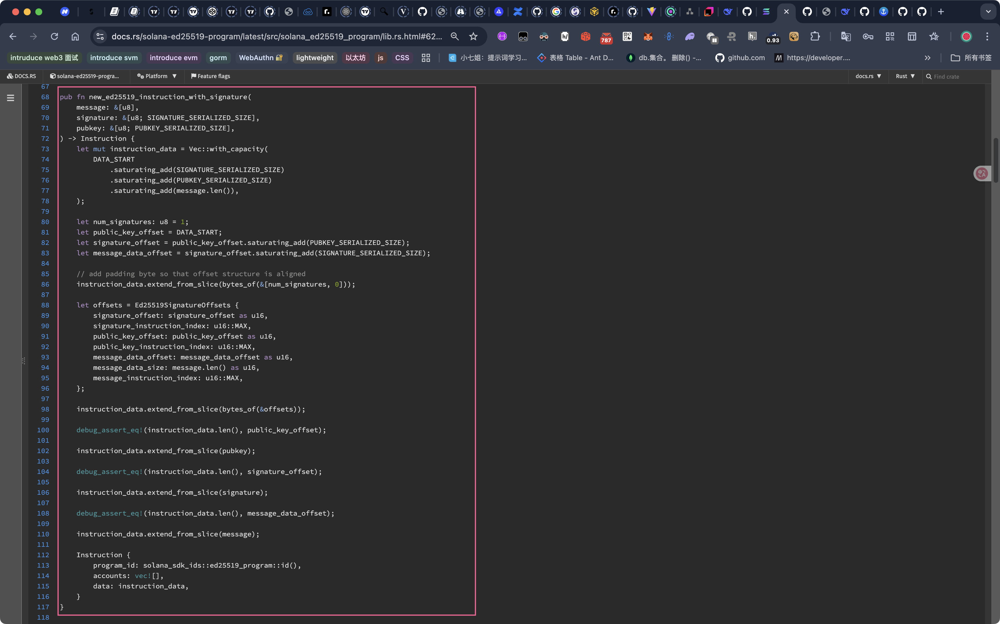

## solana-web3.js/src/programs/ed25519.ts

之所以复杂，是因为传递的是buffer


https://github.com/solana-foundation/solana-web3.js/blob/maintenance%2Fv1.x/src/programs/ed25519.ts






## solana rust encode









## solana rust decode


https://docs.rs/solana-ed25519-program/latest/src/solana_ed25519_program/lib.rs.html#120


## 编码过程梳理

这段 TypeScript 代码实现了 Solana 区块链上的 `Ed25519Program`，用于创建验证 Ed25519 签名的指令（`TransactionInstruction`）。我们来**梳理编码过程的整体流程**，并详细解释每一步。

---

## 🧩 背景知识

在 Solana 中，`Ed25519SigVerify111111111111111111111111111` 是一个内置程序（Program），用于验证 Ed25519 签名。你可以通过构造一个指令（`TransactionInstruction`）来调用它验证某个消息的签名是否有效。

---

## 📦 模块结构概览

### 核心常量
```ts
const PRIVATE_KEY_BYTES = 64;
const PUBLIC_KEY_BYTES = 32;
const SIGNATURE_BYTES = 64;
```

- `PRIVATE_KEY_BYTES`: Ed25519 私钥长度（64 字节）
- `PUBLIC_KEY_BYTES`: 公钥长度（32 字节）
- `SIGNATURE_BYTES`: 签名长度（64 字节）

---

## 🧱 数据结构定义

### 1. `ED25519_INSTRUCTION_LAYOUT`

这是指令数据的结构定义，使用 `@solana/buffer-layout` 来描述指令的前缀部分（metadata）：

```ts
BufferLayout.struct([
  BufferLayout.u8('numSignatures'),               // 签名数量（一般为 1）
  BufferLayout.u8('padding'),                     // 对齐用 padding
  BufferLayout.u16('signatureOffset'),            // 签名在 buffer 中的偏移
  BufferLayout.u16('signatureInstructionIndex'),  // 签名在哪条指令中（通常是当前指令）
  BufferLayout.u16('publicKeyOffset'),            // 公钥的偏移
  BufferLayout.u16('publicKeyInstructionIndex'),  // 公钥在哪条指令中
  BufferLayout.u16('messageDataOffset'),          // 消息数据偏移
  BufferLayout.u16('messageDataSize'),            // 消息长度
  BufferLayout.u16('messageInstructionIndex'),    // 消息在哪条指令中
])
```

这个结构占用固定字节数（`ED25519_INSTRUCTION_LAYOUT.span`），是整个指令数据的头部。

---

## 🔐 方法分析

### 1. `createInstructionWithPublicKey`

使用已有的公钥和签名创建指令。

#### 步骤：

```ts
const publicKeyOffset = ED25519_INSTRUCTION_LAYOUT.span;
const signatureOffset = publicKeyOffset + publicKey.length;
const messageDataOffset = signatureOffset + signature.length;
```

- 首先计算出每个数据块（公钥、签名、消息）在 buffer 中的偏移量。
- 然后分配一个足够大的 buffer 来容纳所有数据：

```ts
const instructionData = Buffer.alloc(messageDataOffset + message.length);
```

- 接着编码 layout 的头部信息：

```ts
ED25519_INSTRUCTION_LAYOUT.encode({...}, instructionData);
```

- 然后把实际数据（公钥、签名、消息）填入 buffer：

```ts
instructionData.fill(publicKey, publicKeyOffset);
instructionData.fill(signature, signatureOffset);
instructionData.fill(message, messageDataOffset);
```

- 最后构造 `TransactionInstruction`：

```ts
return new TransactionInstruction({
  keys: [],
  programId: Ed25519Program.programId,
  data: instructionData,
});
```

---

### 2. `createInstructionWithPrivateKey`

这个方法封装了签名过程，适用于你持有私钥的情况。

#### 步骤：

1. 验证私钥长度。
2. 使用 `Keypair.fromSecretKey` 还原密钥对。
3. 提取公钥。
4. 使用 `sign(message, keypair.secretKey)` 对消息签名。
5. 调用 `createInstructionWithPublicKey` 构造指令。

---

## 🧠 总结：编码过程流程图

```text
createInstructionWithPrivateKey
          ↓
  还原 Keypair（私钥 → 公钥）
          ↓
       签名消息
          ↓
createInstructionWithPublicKey
          ↓
 1. 计算 offset
 2. 分配 buffer
 3. 写入 layout metadata
 4. 填入公钥、签名、消息
 5. 构造 TransactionInstruction
```

---

## 📌 最终生成的指令结构

```ts
{
  keys: [], // 无需账户参与
  programId: Ed25519Program.programId, // 固定为 Ed25519 验签程序
  data: <Buffer> // 编码后的指令数据（包含 layout + 公钥 + 签名 + 消息）
}
```

---

如果你需要，我还可以提供可视化的 buffer 编码结构图，或帮你调试构造的指令是否正确。是否需要？

## 可视化地分析整个指令数据的结构（Buffer 编码结构）


好的！我们来**可视化地分析整个指令数据的结构（Buffer 编码结构）**，帮助你理解 `Ed25519Program.createInstructionWithPublicKey()` 中最终生成的指令数据是如何组织的。

---

## 🎯 目标

我们要可视化的是最终生成的 `instruction.data`，它是一个 `Buffer`，由三部分组成：

1. **Instruction Header（布局头部，固定大小）**
2. **Public Key（32 字节）**
3. **Signature（64 字节）**
4. **Message（可变长度）**

---

## 🧱 Buffer 结构图（字节偏移）

假设：

- 消息长度为 5 字节（`message.length = 5`）
- 公钥和签名长度固定（32 和 64 字节）

### 📦 Buffer 总长度：
```ts
ED25519_INSTRUCTION_LAYOUT.span + 32 + 64 + message.length
= 14 + 32 + 64 + 5 = 115 字节
```

### 📊 字节结构图：

```text
| Byte Offset | Field Name                | Size (bytes) | 描述                            |
| ----------- | ------------------------- | ------------ | ------------------------------- |
| 0           | numSignatures             | 1            | 签名数，一般为 1                |
| 1           | padding                   | 1            | 填充，为 0                      |
| 2           | signatureOffset           | 2 (u16)      | 签名起始偏移（14 + 32 = 46）    |
| 4           | signatureInstructionIndex | 2 (u16)      | 签名所在指令索引（默认 0xffff） |
| 6           | publicKeyOffset           | 2 (u16)      | 公钥起始偏移（14）              |
| 8           | publicKeyInstructionIndex | 2 (u16)      | 公钥所在指令索引（默认 0xffff） |
| 10          | messageDataOffset         | 2 (u16)      | 消息起始偏移（46 + 64 = 110）   |
| 12          | messageDataSize           | 2 (u16)      | 消息长度（如 5）                |
| 14          | messageInstructionIndex   | 2 (u16)      | 消息所在指令索引（默认 0xffff） |

16          | publicKey                     | 32           | 公钥数据
48          | signature                     | 64           | 签名数据
112         | message                       | 5            | 消息数据
```

> ⚠️ 注意：偏移值如 `signatureOffset`、`publicKeyOffset`、`messageDataOffset` 都是相对于整个 `instructionData` buffer 的偏移。

---

## 🧪 示例可视化（16 进制）

假设：

- 公钥为：`0x11 11 11 ...`（32 字节）
- 签名为：`0x22 22 22 ...`（64 字节）
- 消息为：`0x33 33 33 33 33`（5 字节）

```text
| Offset | Hex Dump (示意)            | 内容                     |
| ------ | -------------------------- | ------------------------ |
| 00     | 01 00 2E FF 0E FF 6E 05 FF | Layout Header（14 字节） |
| 0E     | 11 11 11 ...               | 公钥（32 字节）          |
| 2E     | 22 22 22 ...               | 签名（64 字节）          |
| 6E     | 33 33 33 33 33             | 消息（5 字节）           |
```

---

## 🔍 关键字段解释

| 字段名               | 含义                                                   |
| -------------------- | ------------------------------------------------------ |
| `signatureOffset`    | 签名在整个 buffer 中的偏移（= header 长度 + 公钥长度） |
| `publicKeyOffset`    | 公钥偏移 = header 长度                                 |
| `messageDataOffset`  | 消息偏移 = header + 公钥 + 签名                        |
| `*_InstructionIndex` | 设置为 `0xffff` 表示当前指令                           |

---

## 🛠️ 调试建议

你可以在本地打印：
```ts
console.log(instructionData.toString('hex'));
```

然后对照上面的结构图进行分析，验证偏移是否正确。

---

## 🧠 总结

整个指令数据的结构是：

```
[布局头部（14字节）][公钥（32字节）][签名（64字节）][消息（可变）]
```

每一段的数据在头部都明确指定了偏移和长度，Solana 的验证程序会根据这些信息提取数据并进行验证。

---

如果你希望我提供一个完整的示例（包含真实 keypair、签名、消息、最终编码结果），我也可以帮你写一个。是否需要？