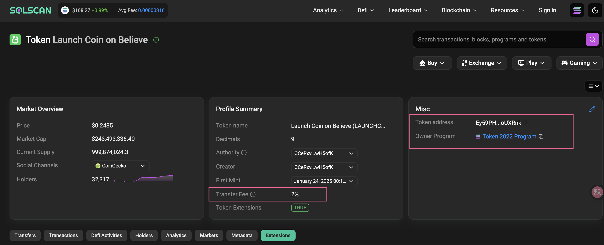
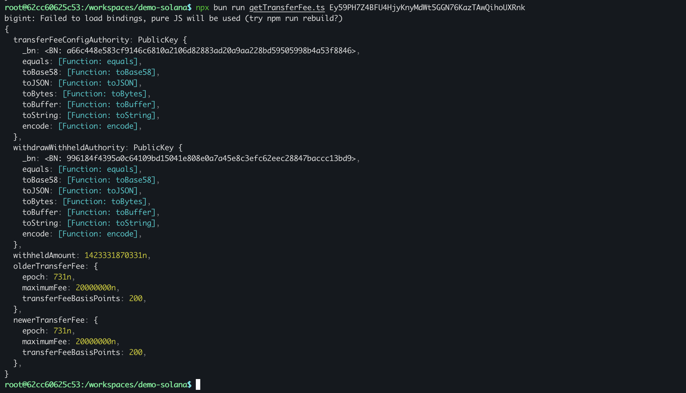

## 上账失败




https://solscan.io/token/Ey59PH7Z4BFU4HjyKnyMdWt5GGN76KazTAwQihoUXRnk#extensions


## 代码

```sh
pnpm install @solana/web3.js @solana/spl-token
pnpm install -D @types/node
```
```ts
import { Connection, PublicKey } from '@solana/web3.js';
import { getTransferFeeConfig, TOKEN_2022_PROGRAM_ID, getMint } from '@solana/spl-token';

// 获取命令行参数
const args = process.argv.slice(2);
if (args.length !== 1) {
    console.error("Usage: ts-node getTransferFee.ts <mintAddress>");
    process.exit(1);
}

const mintAddress = args[0];

async function main() {
    const connection = new Connection('https://api.mainnet-beta.solana.com'); // Replace with your desired cluster
    
    try {
        const mintPublicKey = new PublicKey(mintAddress);
        const mint = await getMint(connection, mintPublicKey, undefined, TOKEN_2022_PROGRAM_ID);
        const transferFeeConfig = await getTransferFeeConfig(mint);

        console.log(transferFeeConfig);
    } catch (error) {
        console.error("Error fetching transfer fee config:", error);
    }
}

main();

```

## 执行

```sh
npx bun run getTransferFee.ts Ey59PH7Z4BFU4HjyKnyMdWt5GGN76KazTAwQihoUXRnk
```
## 配置
```
主网: https://api.mainnet-beta.solana.com

测试网: https://api.testnet.solana.com

开发网: https://api.devnet.solana.com
```
